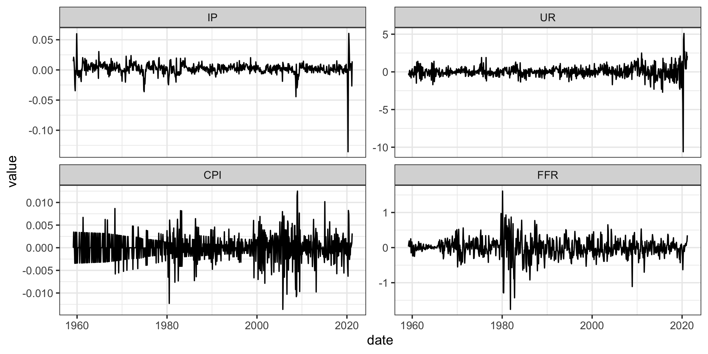
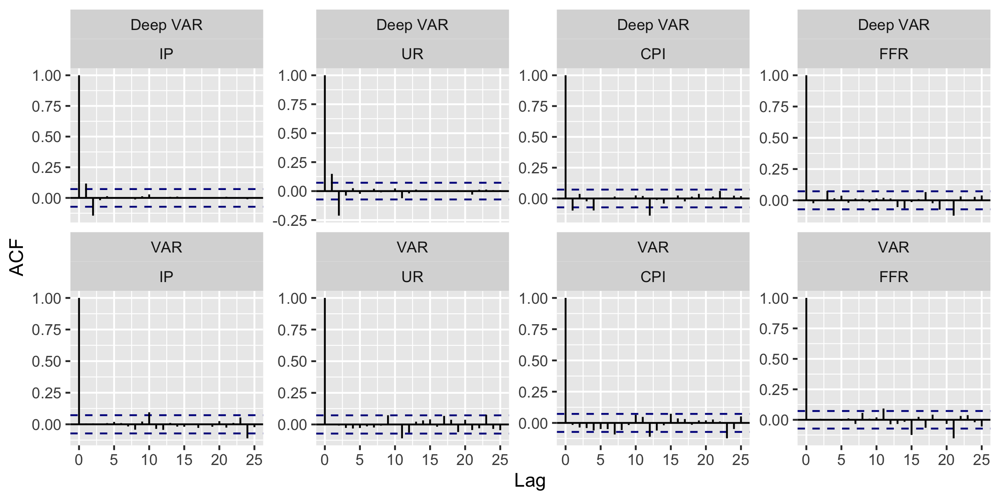
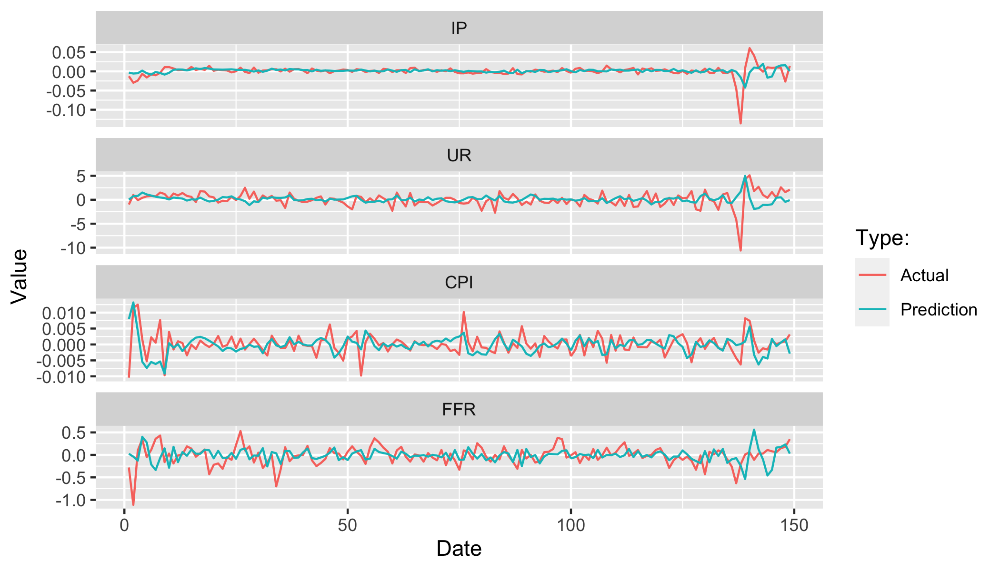
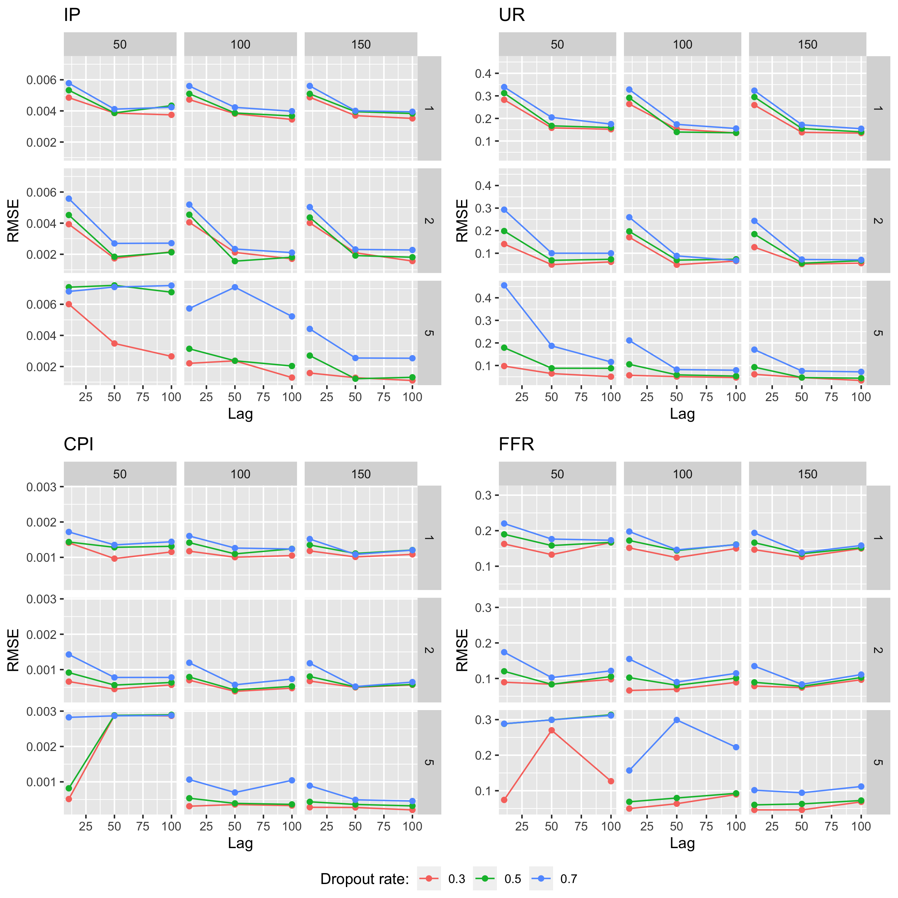
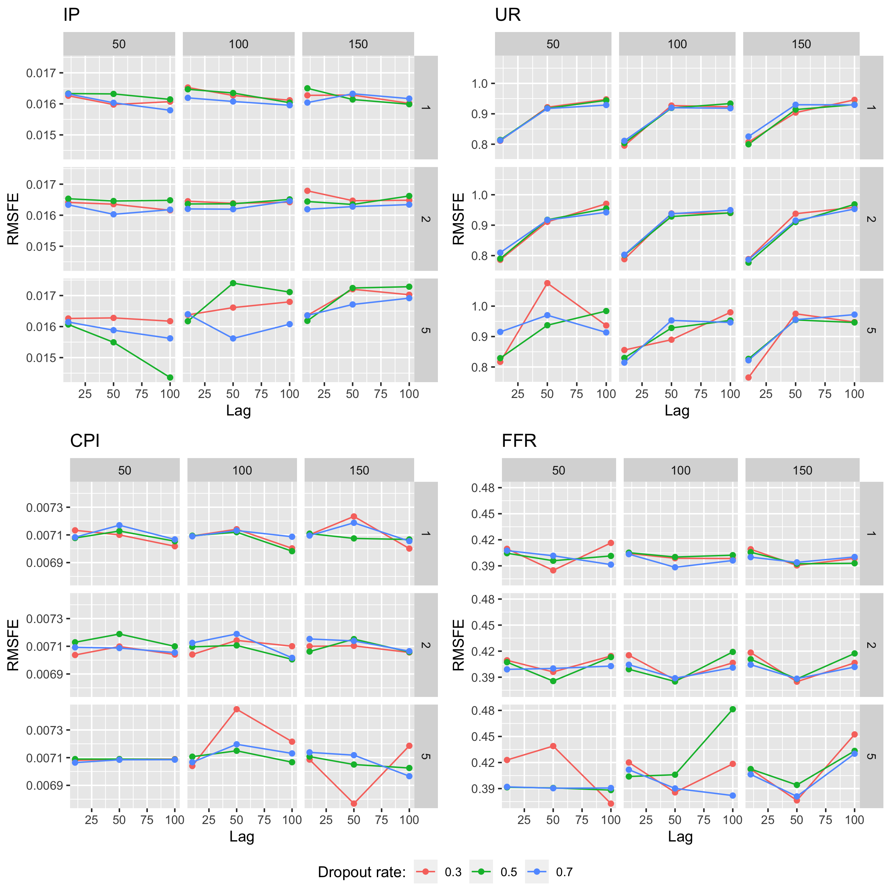

---
output:
  pdf_document: default
  html_document: default
---
# (APPENDIX) Appendix {-}

# Tables {#tables}

```{r, echo=FALSE, results='asis', message= FALSE, warning=FALSE}
library(xtable)
library(plyr)
dtf <- readRDS("data/sum_stats.rds")
options(xtable.comment = FALSE)
xtable(dtf, caption = c("Summary statistics for the full sample."))

```

```{r, echo= FALSE, results='asis', message= FALSE, warning=FALSE}
# Pre Covid vs Post Covid Summary Stats

dtf_pre <- readRDS("data/pre_covid.rds")
options(xtable.comment = FALSE)
xtable(dtf_pre, caption = c("Summary statistics pre Covid."))

```

```{r, echo= FALSE, results='asis', message= FALSE, warning=FALSE}
# Post Covid vs Post Covid Summary Stats

dtf_post <- readRDS("data/post_covid.rds")
options(xtable.comment = FALSE)
xtable(dtf_post, caption = c("Summary statistics post Covid."))

```

\FloatBarrier
\pagebreak

# Figures {#figures}

```{r time-series, fig.cap="Time series"}

```

```{r qqplot-full, fig.cap="Quantile-quantile plots of full-sample residuals."}
knitr::include_graphics("www/qqplot_full.png")
```

```{r acf-full, fig.cap="ACF plots of full-sample residuals."}

```

```{r pred-var-train, fig.cap="VAR fitted values plotted against observed values for the training sample."}
knitr::include_graphics("www/pred_var_train.png")
```

```{r pred-dvar-train, fig.cap="Deep VAR fitted values plotted against observed values for the training sample."}
knitr::include_graphics("www/pred_dvar_train.png")
```

```{r pred-var-test, fig.cap="VAR fitted values plotted against observed values for the test sample."}

```

```{r pred-dvar-test, fig.cap="Deep VAR fitted values plotted against observed values for the test sample."}
knitr::include_graphics("www/pred_dvar_test.png")
```

```{r fcst-var, fig.cap="VAR n-step ahead forecasts plotted against observed values. Forecasts are for the first year of the test sample."}
knitr::include_graphics("www/fcst_var.png")
```

```{r fcst-dvar, fig.cap="Deep VAR n-step ahead forecasts plotted against observed values. Forecasts are for the first year of the test sample."}
knitr::include_graphics("www/fcst_dvar.png")
```

```{r grid-rmse-train, eval=TRUE, fig.cap="Train sample RMSE for Deep VAR for different variables."}

```

```{r grid-rmse-test, eval=TRUE, fig.cap="Test sample RMSE for Deep VAR for different variables."}
knitr::include_graphics("www/grid_rmse_test.png")
```

```{r grid-rmsfe-test, eval=TRUE, fig.cap="Pseudo out-of-sample RMSFE for Deep VAR for different variables."}

```

```{r grid-rmse-benchmark, eval=TRUE, fig.cap="Comparison of out-of-sample RMSE for conventional VAR and Deep VAR for different variables."}
knitr::include_graphics("www/grid_rmse_benchmark.png")
```

```{r grid-rmsfe-benchmark, eval=TRUE, fig.cap="Comparison of pseudo out-of-sample RMSFE for conventional VAR and Deep VAR for different variables."}
knitr::include_graphics("www/grid_rmsfe_benchmark.png")
```

\FloatBarrier
\pagebreak

# R Code and Package {#code}

All code used for the empirical analysis presented in this article can be found on the corresponding [GitHub repository](https://github.com/pat-alt/deepvarsMacro). Researchers interested in using Deep VARs more generally for their own empirical work may find the R `deepvars` package useful which is being maintained by one of the authors. The package is still under development and as of now only available on [GitHub](https://github.com/pat-alt/deepvars). To install the package in R simply run:

```{r, eval=FALSE, echo=TRUE}
devtools::install_github("pat-alt/deepvars", build_vignettes=TRUE)
```

Package vignettes will take you through the basic package functionality. Once the package has been installed simply run `utils::browseVignettes()` to access the documentation.

