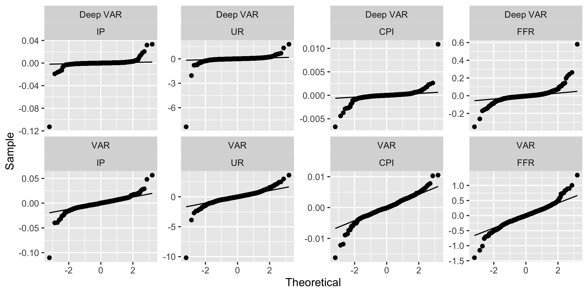

# (APPENDIX) Appendix {-}

# Tables and Figures {#figures}

## Residuals {#resids}

```{r qqplot-full, fig.cap="Quantile-quantile plots of full-sample residuals."}

```

```{r acf-full, fig.cap="ACF plots of full-sample residuals."}
knitr::include_graphics("www/acf_full.png")
```

# R Code and Package {#code}

All code used for the empirical analysis presented in this article can be found on the corresponding [GitHub repository](https://github.com/pat-alt/navar). Researchers interested in using Deep VARs more generally for their own empirical work may find the R `deepvars` package useful which is being maintained by one of the authors. The package is still under development and as of now only available on [GitHub](https://github.com/pat-alt/deepvars). To install the package in R simply run:


```{r, eval=FALSE, echo=TRUE}
devtools::install_github("pat-alt/deepvars", build_vignettes=TRUE)
```

Package vignettes will take you through the basic package functionality. Once the package has been installed simply run `utils::browseVignettes()` to access the documentation.

