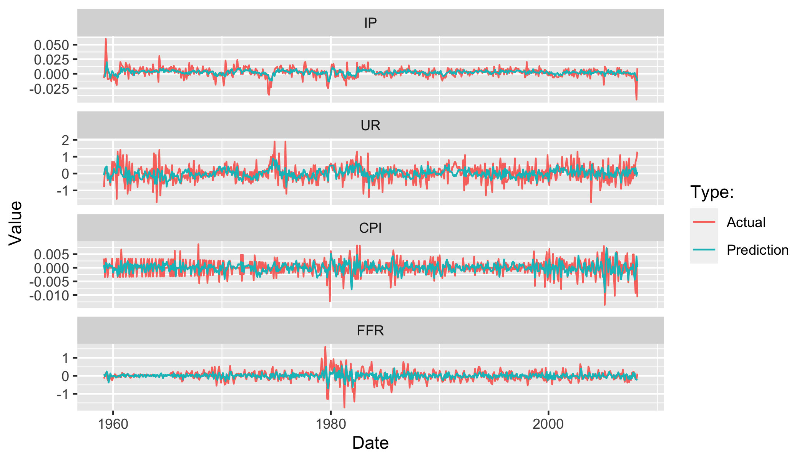
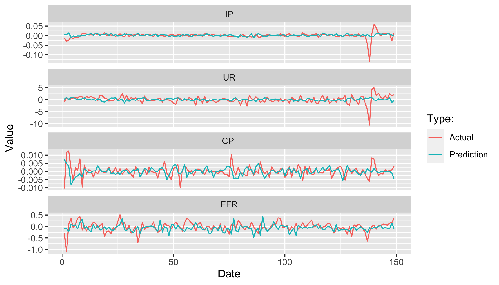
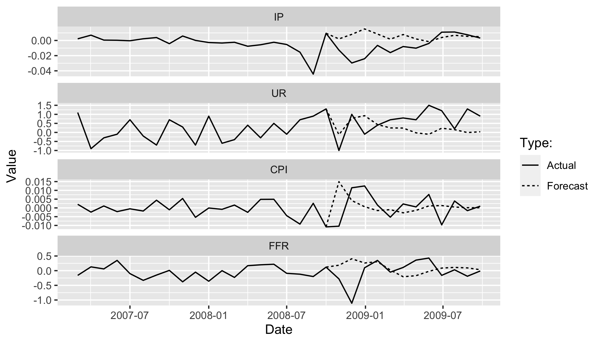
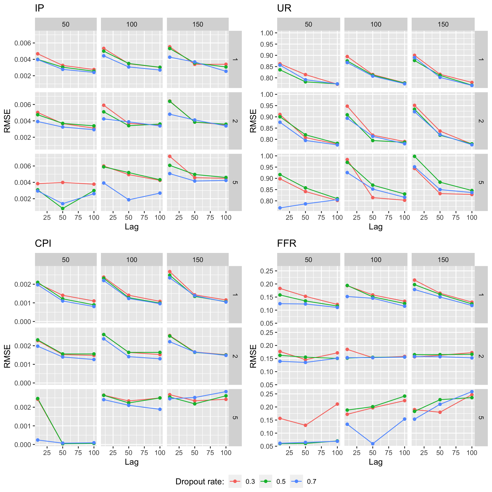
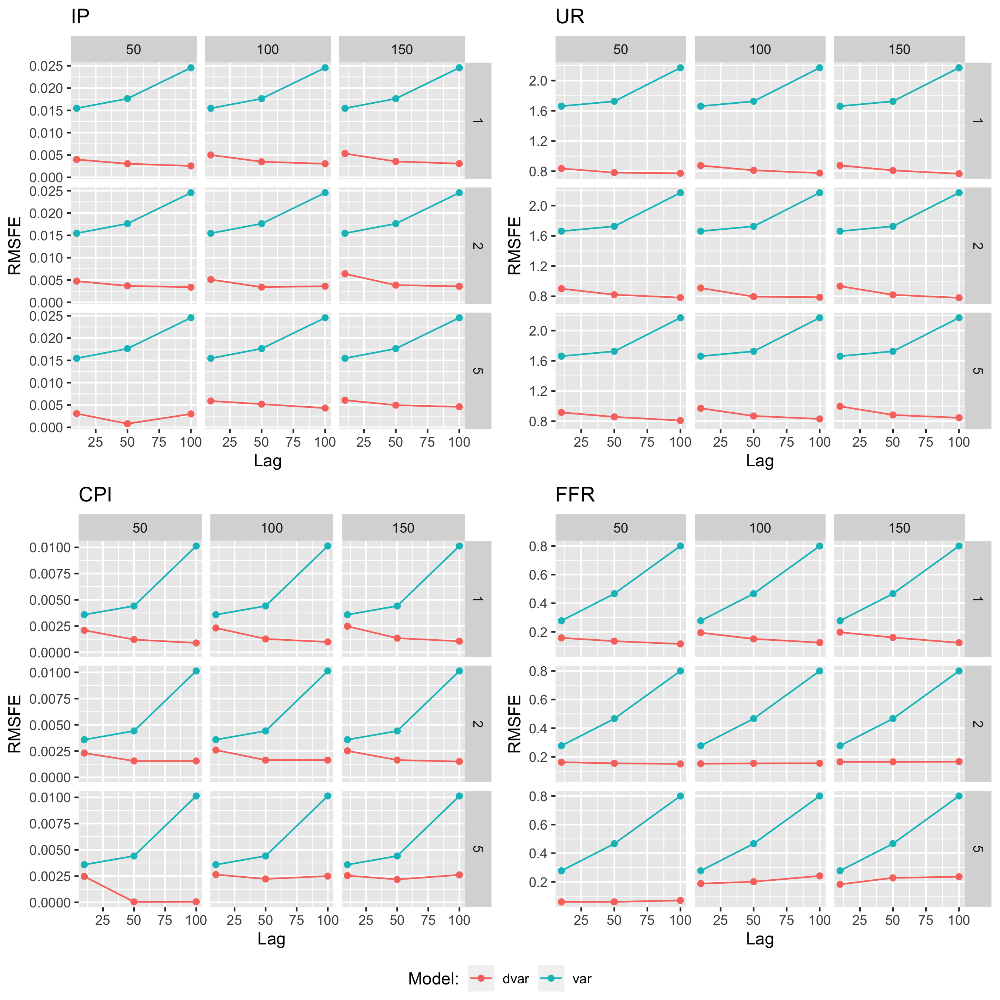

# Introduction

As stated by the European Central Bank, the monetary transmission mechanism is the process through which monetary policy decisions affect the economy in general and the price level in particular. Uncertainty with respect to this transmission is generally huge, given that it is characterized by long, variable and uncertain dependencies through time and variables. Hence, it is typically challenging to predict how changes in monetary policy actions affect real economic outcomes. It is therefore of foremost importance for policy-makers to use adequate tools to model the underlying mechanisms.

With this in mind, a lot of research on the forecasting of time series has been developed to assess the effect of current policy decisions on future economic variables. Thanks to this, over the last decades policy makers have had more information when taking decisions. This information usually comes in the form of point estimates and interval forecasts. To come up with these estimates, several methodologies have been developed and applied in the time series forecasting literature. 

At the time of writing, one the most common methodologies to produce these estimates is the so-called Vector Autoregression (VAR). This framework, which belongs to the traditional toolkit of econometric forecasting techniques, has been shown to provide policy-makers with fairly good and consistent point and interval estimates. It has therefore been used extensively in the monetary policy divisions of central banks.

Simultaneously, with the recent advancements in computational power, and more importantly, the development of advanced machine learning algorithms and deep learning, interesting novel tools have become available that may be useful for forecasting time series. Whereas the good performance of techniques such as VAR is well established, it is still uncertain whether deep learning algorithms can be applied successfully to macroeconomic data. 

To this end, this paper contributes a new and ground-breaking methodology that combines the VAR equation-by-equation structure with deep learning. We provide evidence that this improves the model's capacity to capture potentially highly non-linear relationships in the underlying data generating process. The primary objective of this paper is to develop a methodology that produces improved modelling outcomes while deviating as little as possible from the established VAR framework, thereby keeping things straight-forward and familiar to economists. We show that the existing VAR methodology can be easily extended to the broader class of Deep VAR models and provide solid empirical evidence that Deep VAR models consistently outperform the conventional approach. 

To the best of our knowledge, this is the first paper to propose a Deep VAR framework of this structure, namely, to fit a deep neural network for each equation of the VAR process. Although previous work has explored the use of deep learning to forecast macroeconomic time series, previous proposed methodologies deviate more from the conventional VAR framework. For example, @verstyuk2020modeling chooses to model the whole system through one unified deep neural network. We find that the equation-by-equation approach not only helps to maintain interpretability and simplicity, but also appears to produce better modelling outcomes. To enable researchers and practitioners to easily implement our proposed methodology, we have developed a [unified framework](https://github.com/pat-alt/deepvars) for estimating Deep VAR models in R and plan to continue its development going forward.

We find that the Deep VAR methodology outperforms the traditional VAR framework in terms of in-sample and out-of-sample fit as well as with respect to forecasting accuracy. In particular, the Deep VAR appears to be better at capturing non-linear dynamics underlying the time series process. It therefore leads to consistently lower modelling errors than the VAR, especially during periods of economic downturn and uncertainty. 

Arguably policy makers are not only interested in the forecasting accuracy of the model, but are typically also concerned with inference. For example, central banks are often interested in knowing to what extent interest rates granger cause other variables within the monetary transmission mechanism. Another aspect policy makers and researchers care about is how the variables of the system evolve through time in response to innovations. This information is typically recovered using Impulse Response Functions (IRFs). The linear additive modelling assumption underlying the conventional VAR makes inference straight-forward. In the case of Deep VAR models inference is arguably more complicated, though promising avenues have recently been explored [@verstyuk2020modeling]. We believe that the methodology proposed in this paper can be augmented to the inference realm in future work.

The remainder of the paper is structured as follows: in section <a href="#lit-review">2</a> we present a literature review of prior research on the methodologies used to provide forecasts and on the monetary transmission mechanism in general. Section <a href="#data">3</a> provides a detailed description of the data we use for our empirical exercises. In section <a href="#methodology">4</a> we present the traditional VAR methodology and develop our proposed Deep VAR model. Sections <a href="#empirics">5</a> and <a href="#exten">6</a> present our empirical findings and possible extensions and caveats, respectively. Finally, section <a href="#concl">7</a> concludes. 


# Literature review {#lit-review}

There is broad agreement among economists on the fact that monetary policy affects economic activity in the short and medium term. @friedman2008monetary found that monetary policy actions are followed by movements in real output that may last for two years or more (@romer1989does; @bernanke1990federal). The underlying forces that trigger these outcomes is of great interest to most economists. Central bankers in particular aim to understand the monetary transmission mechanism. If monetary policy affects the real economy, then what exactly is the transmission mechanism through which these effects occur? This is one of the questions which is among the most important and controversial topics in modern-day macroeconomics.

In the aftermath of the oil price shock in the 1970's, interest emerged in understanding business cycles. To this end economists initially made use of large-scale macroeconomic models, which was criticized by @lucas1976econometric, stating that the assumption of invariant behavioural equations was inconsistent with dynamic maximizing behaviour. Hence, **New Classical** economists started to make use of so-called market clearing models of economic fluctuations. With the goal of really taking into account productivity shocks, **Real Business Cycle** models were developed (@kydland1982time).

Following the failure of large-scale macroeconomic models when trying to predict business cycles, the economic profession resorted to structural vector autoregressive (VAR) models to analyse business cycles, which proved to be useful for capturing the impact of policy actions. @sims1986forecasting suggested that VAR models were an efficient tool to evaluate macroeconomic models. One of the advantages of VAR models is their simplicity, which makes it easy to estimate and interpret them. 

Yet, this simplicity comes at a cost: conventional VAR models are typically not able to capture non-linear relationships in the data, which might be a significant limitation. 
In the very short run many time series can be expected to behave more or less according to their past and a linear model may be efficient to capture dynamics, but for longer term dependencies this is typically not the case. With respect to the economic time series that form part of the monetary transmission mechanism, specifically output, inflation, interest rates and labour market variables, non-linear dependencies are likely to form part of the data generating process as shown by @brock1991nonlinear. This is true in particular during times of abrupt and significant economic fluctuations.

During past years, economists have therefore started to add non-linear techniques to their forecasting tool kit. Machine Learning has contributed a lot to this field of research. Some of the most popular machine learning techniques which do not assume a linear relationship between inputs and outputs include K-Nearest Neighbours (first introduced by @fix1951important), Support Vector Machines (mostly developed by @cortes1995support), Random Forests (first introduced in 1995 by @ho1995random) and Deep Artificial Neural Networks (first proposed in 1943 by @mcculloch1990logical). The latter have been explored previously in the realm of time series forecasting (@hamzaccebi2008improving, @zhang2003time, @kihoro2004seasonal). Neural networks are non-parametric models that have been shown to be particularly successful at capturing non-linearities (@zhang1998forecasting, @zhang2003time).

A particular subclass of neural networks used primarily for sequential data are recurrent neural networks (RNN). RNNs propagate previous outputs recursively allowing the model to learn persistent dependencies and thereby making them very efficient for time series data [@dorffner1996neural]. A recent staff working paper published by the Bank of England provides some empirical support for the argument that deep learning can be successfully applied to macroeconomic data [@joseph2021forecasting]. The authors run a horse race for forecasting inflation across different time horizons comparing the performance of linear and non-linear models. They find that neural networks in particular and also other common machine learning algorithms are useful for forecasting particularly at a longer horizon. 


# Data {#data}


To evaluate our proposed methodology empirically we use a sample of monthly US data on leading economic indicators, which spans the period of January 1959 through March 2021. We use the relatively novel FRED-MD data base which is updated monthly and publicly available [@mccracken2016fred]. The sample spans from March, 1959 to March, 2021 providing us with a relatively rich data set of macroeconomic time series with $T=745$ observations.

In order to investigate the monetary transmission mechanism, the literature typically focuses on variables related to economic output, inflation, short and long term interest rates as well as labour market indicators. Some go beyond to also include stock price indices, money and credit aggregates, balance of payments figures, confidence indicators and some cases foreign domestic indicators. In this paper we limit our attention to the four main indicators mentioned above. In particular we use changes in the industrial production index (IP) to measure output growth, changes in the growth of the (all items) consumer price index (CPI) to measure inflation, the Federal Funds Rate (FFR) as our interest rate and the unemployment rate (UR) as our labour market indicator. Note that we use IP rather than the gross domestic product as a proxy for output, because the latter is only available at quarterly frequency. 

Another strength of the FRED-MD is the fact that the data is already preprocessed. Specifically, the industrial production index comes in log differences, the CPI in second-order log differences and both the Fed Funds Rate and the unemployment rate in first-order differences. This has allowed us to let the data enter into our estimations without any further adjustments, which should facilitate the reproducibility of our results.


# Methodology {#methodology}

In conventional Vector Autoregression (VAR) dependencies of any system variable on past realizations of itself and its covariates are modelled through linear equations. This corresponds to a particular case of the broader class of Deep Vector Autoregressions investigated here and will serve as the baseline for our analysis.

## Vector Autoregression {#var}

Let $\mathbf{y}_t$ denote the $(K \times 1)$ vector of variables at time $t$. Then the VAR($p$) with $p$ lags and a constant deterministic term is simply a linear system of stochastic equations of the following form:

\begin{equation} 
\begin{aligned}
&& \mathbf{y}_t&=\mathbf{c} + \mathbf{A}_1 \mathbf{y}_{t-1} + \mathbf{A}_2 \mathbf{y}_{t-2} + ... + \mathbf{A}_p \mathbf{y}_{t-p} + \mathbf{u}_t, && \mathbf{u}_t&\sim \mathcal{N}(\mathbf{0},\Sigma_u) \\
\end{aligned}   (\#eq:redform)
\end{equation}$$

The matrices $\mathbf{A}_m \in \mathbb{R}^{K \times K}$, where $m\in\{1,...,p\}$, contain the reduced form coefficients and $\mathbf{u}_t \in \mathbb{R}^{K \times1}$ is a vector of errors for which $\mathbb{E}\mathbf{u}_t$, $\mathbb{E}\mathbf{u}_t\mathbf{u}_t^T=\Sigma$ and $\mathbb{E}\mathbf{u}_t\mathbf{u}_s^T=\mathbf{0}$ for all $t\ne s$. We refer to (4.1) as the **reduced form** representation of the VAR($p$) because all right-hand side variables are predetermined [@kilian2017structural]. 

We can restate (4.1) more compactly as 

\begin{equation} 
\begin{aligned}
&& \mathbf{y}_t&=\mathbf{A} \mathbf{Z}_{t-1} + \mathbf{u}_t \\
\end{aligned}
(\#eq:sur)
\end{equation}$$

where $\mathbf{A}=(\mathbf{c},\mathbf{A}_1,\mathbf{A}_2,...,\mathbf{A}_p) \in \mathbb{R}^{K \times (Kp+1)}$ and $\mathbf{Z}_{t-1}=(1,\mathbf{y}_{t-1}^T,...,\mathbf{y}_{t-p}^T)^T \in \mathbb{R}^{(Kp+1)\times1}$. The expression in (4.2) demonstrates that the VAR($p$) can be considered as a **seemingly unrelated regression** (SUR) model composed of individual regressions with common regressors [@greene2012econometric]. In fact, it is useful to note for our purposes that the VAR($p$) can be estimated efficiently through equation-by-equation OLS regression. In particular, it follows from (4.2) that

\begin{equation} 
\begin{aligned}
&& y_{it}&=c_i+\sum_{m=1}^{p}\sum_{j=1}^{K}a_{jm}y_{jt-m}+u_{it}&&,&&\forall i=1,...,K\\
\end{aligned}
(\#eq:single-var)
\end{equation}$$

which corresponds to the key modelling assumption that at any point in time $t$ any time series $i\in1,...,K$ is just a weighted sum of past realizations of itself and all other variables in the system. This assumption makes the estimation of VAR($p$) processes remarkably simple. Perhaps more importantly, the assumption of linearity also greatly facilitates inference about VAR models. 

For implementation purposes it is generally more useful to estimate the VAR($p$) through one single OLS regression. To this end let $\mathbf{\tilde{A}}=\mathbf{A}^{T}$ and note that (4.2) can be restated even more compactly as 

\begin{equation} 
\begin{aligned}
&& \mathbf{y}&=\mathbf{Z} \mathbf{\tilde{A}} +  \mathbf{u}_t \\
\end{aligned}
(\#eq:var-ols)
\end{equation}$$

with $\mathbf{y}=(\mathbf{y}_1,...,\mathbf{y}_T)^T \in \mathbb{R}^{T \times K}$ and $\mathbf{Z} \in \mathbb{R}^{T \times (Kp+1)}$. Then the closed form solution for OLS is simply $\mathbf{\tilde{A}}=(\mathbf{Z}^T\mathbf{Z})^{-1}\mathbf{Z}^T\mathbf{y}$ and hence

\begin{equation} 
\begin{aligned}
&& \mathbf{A}&=\mathbf{y}^T\mathbf{Z}(\mathbf{Z}\mathbf{Z}^T)^{-1} \\
\end{aligned}
(\#eq:ols-sol)
\end{equation}$$

## Deep Vector Autoregression {#deepvar}

We propose the term Deep Vector Autoregression to refer to the broad class of Vector Autoregressive models that use deep learning to model the dependences between system variables through time. In particular, as before, we let $\mathbf{y}_t$ denote the $(K \times 1)$ vector that describes the state of system at time $t$. Consistent with the conventional VAR structure we assume that each individual time series $y_{it}$ can be modelled as a function of lagged realizations of all variables $y_{jt-p}$, $j=1,...,K$, $m=1,...,p$. More specifically, we have 

\begin{equation} 
\begin{aligned}
&& y_{it}&=f_i\left(\mathbf{y}_{t-1:t-p};\theta\right)+v_{it} &&,&&\forall i=1,...,K \\
\end{aligned}
(\#eq:single-dvar)
\end{equation}$$

where $\mathbf{y}_{t-1:t-p}=\left\{y_{jt-m}\right\}^{m=1,...,p}_{j=1,...,K}$ is the vector of lagged realizations, $f_i$ is a variable specific mapping from past lags to the present and $\theta$ is a vector of parameters. While in the conventional VAR above we assumed that the multivariate process can be modelled as a system of linear stochastic equations, our proposed Deep VAR($p$) can similarly be understood as a system of potentially highly non-linear equations. As we argued earlier, Deep Learning has been shown to be remarkably successful at learning mappings of arbitrary functional forms [@goodfellow2016deep]. 

Note that the input and output dimensions in (4.6) are exactly the same as in the conventional VAR($p$) model (equation (4.3)): $f_i$ maps from $\mathbf{y}_{t-1:t-p} \in \mathbb{R}^{Kp \times1}$ to a scalar. Our proposed plain-vanilla approach to Deep VAR models diverges as little as possible from the conventional approach: it boils down to simply modelling each of the univariate outcomes in (4.6) as a deep neural network. We can restate this approach more compactly as 

\begin{equation} 
\begin{aligned}
&& \mathbf{y}_t&= \mathbf{f}(\mathbf{y}_{t-1:t-p};\theta) + \mathbf{v}_t \\
\end{aligned}
(\#eq:dvar)
\end{equation}$$

where $\mathbf{f}(\cdot)=(f_1(\cdot), f_2(\cdot),...,f_K(\cdot))^T \in \mathbb{R}^{K \times1}$ is just the stacked vector of mappings to univariate outcomes described in (4.6).

The notation in (4.7) gives rise to a more unified and general approach to Deep VAR models that would treat the whole process as one single dynamical system to be modelled through one deep neural network $\mathbf{g}$:

\begin{equation} 
\begin{aligned}
&& \mathbf{y}_t&= \mathbf{g}(\mathbf{y}_{t-1:t-p};\theta) + \mathbf{v}_t \\
\end{aligned}
(\#eq:dvar-uni)
\end{equation}$$

This approach is in fact proposed and investigated by @verstyuk2020modeling in his upcoming publication. We decided to go with the approach in (4.7) for two reasons: firstly, the link to conventional VAR models is made abundantly clear through this implementation and, secondly, we found that the equation-by-equation approach produces good modelling outcomes and is relatively easy to implement using state-of-the art software.

Finally, note that if $f_i$ in (4.3) is assumed to be linear and additive for all $i=1,...,K$ then we are back to the conventional VAR($p$). This illustrates the point we made earlier that the linear VAR($p$) is just a particular case of a Deep VAR($p$). Since the model described in equations (4.6) and (4.7) is less restrictive but otherwise consistent with the conventional VAR framework, we expect that it outperforms the traditional approach towards modelling multivariate time series processes.

## Deep Neural Networks - a whistle-stop tour

So far we have been speaking about deep learning in rather general terms. For example, above we have referred to our model of choice for learning the mapping $f_i: \mathbf{y}_{t-1:t-p} \mapsto y_{it}$ as a **deep neural network**. The class of deep neural networks can further be roughly divided into **feedforward neural networks** and **recurrent neural networks**. As the term suggests, the latter is generally used for sequential data and therefore our preferred model of choice. Nonetheless, below we will begin by briefly exploring feedforward neural networks first. This should serve as a good introduction to neural networks more generally and (even though we have not tested this empirically) there is good reason to believe that even Deep VAR models using feedforward neural networks perform well.

### Deep Feedforward Neural Networks

The term **deep feedforward neural network** or **multilayer perceptron** (MLP) is used to describe a broad class of models that are composed of possibly many functions that together make up the directed acyclical graph. The functions $f_i(\cdot)$ - sometimes referred as layers $\mathbf{h}_{i}$ - are chained together hierarchically with the first layer feeding forward its outputs to the second layer and so on [@goodfellow2016deep]. Applied to our case, an MLP with $H$ hidden layers can be loosely defined as follows:

\begin{equation} 
\begin{aligned}
&& f_i(\mathbf{y}_{t-1:t-p};\theta)&=f_i^{(H)}\left(f_i^{(H-1)}\left(...f_i^{(1)}\left(\mathbf{y}_{t-1:t-p}\right)\right)\right) \\
\end{aligned}
(\#eq:mlp)
\end{equation}$$

The depth of the MLP is defined by the number of hidden layers $H$, where, generally speaking, deeper networks are more complex. 

The desired outputs of any $f_i^{(h)}$ that will serve as inputs for $f_i^{(h+1)}$ cannot be inferred from the training data $\mathbf{y}_{t-1:t-p}$ ex-ante, which is where the term **hidden** layer stems from. Each $f_i^{(h)}$ is typically valued on a vector of hidden units, each of them receiving a vector of inputs from $f_i^{(h-1)}$ and returning a scalar that is referred to as activation value. This approach is inspired by neuroscience, hence the term **neural** network [@goodfellow2016deep].

### Deep Recurrent Neural Networks

**Recurrent neural networks** (RNN) are based on the idea of persistent learning: a continuous process that evolves gradually and at each step uses information about its prior states instead of continuously reinventing itself and starting from scratch. To this end, RNNs develop the basic concepts underlying feedforward neural networks by incorporating feedback loops. Formally the loop is typically made explicit as follows

\begin{equation} 
\begin{aligned}
&& \mathbf{h}_t&=f(\mathbf{h}_{t-1},\mathbf{x}_t;\theta) \\
\end{aligned}
(\#eq:hidden-state)
\end{equation}$$

where $\mathbf{h}_t \in \mathbb{R}^{N \times1}$ corresponds to the hidden state of the dynamical system at time $t$ that the RNN learns [@goodfellow2016deep], and $N$ corresponds to the number of hidden units in each hidden layer, known as the width of the layer. In the given context we have that $\mathbf{x}_t=\mathbf{y}_{t-1:t-p}$ as specified in (4.7). Given some random initial hidden state vector $\mathbf{h}_0$ the RNN updates parameters sequentially at each time step $t$ as follows

\begin{equation} 
\begin{aligned}
&& \mathbf{a}_t&=\mathbf{b} + \mathbf{W}\mathbf{h}_{t-1} + \mathbf{U}\mathbf{h}_{-1} \\
&& \mathbf{h}_{t}&=\tanh(\mathbf{a}_t) \\
&& \hat{y}_{it}&=c + \mathbf{v}^T\mathbf{h}_t\\
\end{aligned}
(\#eq:rnn)
\end{equation}$$

where $\mathbf{b} \in \mathbb{R}^{N \times1}$ is a vector of constants (biases), $c \in \mathbb{R}$  is a scalar that captures the deterministic term of the VAR, $\tanh$ is the hyperbolic tangent activation function, $\mathbf{W},\mathbf{U}\in \mathbb{R}^{N \times N}$ are coefficient matrices and $\mathbf{v} \in \mathbb{R}^{N \times 1}$ is a vector of coefficients. Note that to simplify the notation we have omitted the layer index in (4.11): to be specific, $\mathbf{h}_t$ really represents $\mathbf{h}^{(H)}_t$ (the ultimate hidden layer), $\mathbf{h}_{-1}$ stands for $\mathbf{h}^{(H-1)}_t$ (the penultimate layer). Finally, at each step $t$ the first layer $\mathbf{h}^{(0)}_t$ of the forward propagation corresponds to $\mathbf{y}_{t-1:t-p}$. 

A shortfall of generic recurrent neural networks is that they fail to capture long-term dependencies. More specifically, if parameters are propagated over too many stages in a simple RNN, it typically suffers from the problem of **vanishing gradients** [@goodfellow2016deep]. Fortunately, there exist effective extensions of the RNN, most notably the long short-term memory (LSTM), which was introduced by @hochreiter1997long and is our model of choice for Deep VAR models. The key idea underlying LSTMs is to regulate exactly how much information is propagated from one cell state vector $\mathbf{C}_{t-1}$ to the next $\mathbf{C}_{t}$ through the introduction of so called sigmoid gates:


> "The LSTM [has] the ability to remove or add information to the cell state, carefully regulated by structures called gates. Gates are a way to optionally let information through."
--- @olah2015understanding

These regulating gate layers include a **forget gate** $\mathbf{f}_t$, an **input gate** $\mathbf{i}_t$ and a **output gate** $\mathbf{o}_t$. Each of them are vector-values sigmoid functions whose elements $\mathbf{f}_{it},\mathbf{i}_{it},\mathbf{o}_{it}$ are bound between $0$ and $1$. Their individual purposes are implied by their names: faced with $\mathbf{h}_{t-1}$ and $\mathbf{y}_{t-1:t-p}$, the forget gate regulates how much of each individual unit in $\mathbf{C}_{t-1}$ is retained. Then the input gate regulates which units of $\mathbf{C}_{t-1}$ should be updated and to what candidate values $\mathbf{\tilde{C}}_{t-1}$. Using the previous two steps the actual update is performed according to the following rule

\begin{equation} 
\begin{aligned}
&& \mathbf{C}_{t}&=\mathbf{f}_t \odot \mathbf{C}_{t-1} + \mathbf{i}_t \odot \mathbf{\tilde{C}}_{t-1}\\
\end{aligned}
(\#eq:lstm-update)
\end{equation}$$

where $\odot$ indicates the element-wise product. Finally, the output gate acts like a filter on $\mathbf{C}_{t}$: the new hidden state is computed as $\mathbf{h}_{t}=\mathbf{o}_t \odot \tanh (\mathbf{C}_{t})$ where as before we use the hyperbolic tangent as our activation function.^[For a clear and detailed exposition see @olah2015understanding.] Formally, we can summarize the LSTM neural network underlying our Deep VAR framework as follows:

\begin{equation} 
\begin{aligned}
&& \mathbf{f}_t&=\sigma \left( \mathbf{b}_f + \mathbf{W}_f\mathbf{h}_{t-1} + \mathbf{U}_f\mathbf{h}_{-1} \right) \\
&& \mathbf{i}_t&=\sigma \left( \mathbf{b}_i + \mathbf{W}_i\mathbf{h}_{t-1} + \mathbf{U}_i\bf{h}_{-1} \right) \\
&& \mathbf{o}_t&=\sigma \left( \mathbf{b}_o + \mathbf{W}_o\mathbf{h}_{t-1} + \mathbf{U}_o\mathbf{h}_{-1} \right) \\
&& \mathbf{C}_t&=\mathbf{f}_t \odot \mathbf{C}_{t-1} + \mathbf{i}_t \odot \tanh \left( \mathbf{b}_C + \mathbf{W}_C\mathbf{h}_{t-1} + \mathbf{U}_C\mathbf{h}_{-1} \right) \\
&&\mathbf{h}_{t}&=\mathbf{o}_t \odot \tanh (\mathbf{C}_t) \\
&& \hat{y}_{it}&=c + \mathbf{v}^T\mathbf{h}_t\\
\end{aligned}
(\#eq:lstm)
\end{equation}$$

which is best understood when read from top to bottom. Once again we have simplified the notation by omitting the layer index in (4.11). The same notation as before applies.

## Model selection

There are at least two important modelling choices to be made in the context of conventional VAR models. The first choice concerns properties of the time series data itself, in particular the order of integration and cointegration. The second choice is about the the lag order $p$. In order to arrive at appropriate decisions regarding these choices the VAR literature provides a set of guiding principles. We propose to apply these same principles to the Deep VAR, firstly because they are intuitive and simple and secondly because treating both models equally to begin with allows for a better comparison of the two models at the subsequent modelling stages.

### Stationarity {#stationarity}

When working with time series we are generally concerned about stationarity. Broadly speaking stationarity ensures that the future is like the past and hence any predictions we make based on past data adequately describe future outcomes. In order to state stationarity conditions in the VAR context it is convenient to restate the $K$-dimensional VAR($p$) process in companion form as

\begin{equation} 
\begin{aligned}
&& \mathbf{Y}_t&= \begin{pmatrix}
 \mathbf{c} \\
0 \\
\vdots \\
0 \\
\end{pmatrix} + \mathbf{A} \mathbf{Y}_{t-1} + \begin{pmatrix}
 \mathbf{u}_t \\
0 \\
\vdots \\
0 \\
\end{pmatrix}  \\
\end{aligned}
(\#eq:companion)
\end{equation}$$

where $\mathbf{Y}_t=(\mathbf{y}_t^T,...,\mathbf{y}^T_{t-p+1})^T \in \mathbb{R}^{Kp \times1}$ and $\mathbf{A} \in \mathbb{R}^{Kp \times Kp}$ is referred to as the companion matrix [@kilian2017structural]. Stationarity of the VAR($p$) follows from stability: a VAR($p$) is stable if the effects of shocks to the system eventually die out. Stability can be assessed through the system's autoregressive roots or equivalently by looking at the eigenvalues of the companion matrix $\mathbf{A}$ [@kilian2017structural]. In particular, for the VAR($p$) in (4.14) to be stable we condition that the $Kp$ eigenvalues $\lambda$ that satisfy 

$$
\begin{aligned}
&& \det (\mathbf{A} - \lambda \mathbf{I}_{Kp})&=0 \\
\end{aligned}
$$

are all of absolute value less than one. Stability implies that the first and second moments of the VAR($p$) process are time-invariant, hence ensuring weak stationarity [@kilian2017structural]. 

A straight-forward way to deal with stationarity of VAR models is to simply ensure that the individual time series entering the system are stationary. This usually involves differencing the time series until they are stationary: for any time series $y_i$ that is integrated of order $I(\delta)$, there exists a $\delta$-order difference that is stationary. An immediate drawback of this approach is the loss of information contained in the levels of the time series. Modelling approaches that take into account conintegration of individual time series can ensure system stationarity and still let individually non-stationary time series enter the system in levels [@hamilton2020time]. 

### Lag order

The VAR's lag order $p$ can to some extent be thought of as the persistency of the process: past innovations that still affect outcomes in time $t$ happened at most $p$ periods ago. From a pure model selection perspective we can also think of additional lags in terms of additional regressors that add to the model's complexity. From that perspective, choosing a lower lag order corresponds to a form of regularization as it pertains to a more parsimonious model.

Various strategies have been proposed to estimate the true or optimal lag order $p$ empirically [@kilian2017structural]. Among the most common ones are sequential testing procedures and selection based on information criteria. The former involves sequentially adding or removing lags - **bottom-up** and **top-down** testing, respectively - and then testing model outcomes in each iteration. A common point of criticism of sequential procedures is that the order tests matters (@lutkepohl2005new).
 
Here we will focus on selection based on information criteria, which to some extent makes the trade-off between bias an variance explicit [@kilian2017structural]. In particular, it generally involves minimizing information criteria of the following form

\begin{equation} 
\begin{aligned}
&& C(m)&= \log(\det(\hat\Sigma(m))) + \ell(m)\\
\end{aligned}
(\#eq:ic)
\end{equation}$$

where $\hat\Sigma$ is just the sample estimate of the covariance matrix or errors and $\ell$ is a loss function that penalizes high lag orders. In particular, we have that our best estimate of the optimal lag order $p$ is simply

\begin{equation} 
\begin{aligned}
&& \hat{p}&=\arg\min_{m\in\mathcal{P}}C(m) \\
\end{aligned}
(\#eq:ic-min)
\end{equation}$$

where $\mathcal{P}=[m_{\min},m_{\max}]$. We will consider all of the most common functional choices for (4.15).

### Neural Network Architecture

By now it should be clear that deep neural networks come in many shapes and sizes. When thinking about the architecture of a neural network many different design choices can be made and networks can thus be tailored to specific use cases. Here, we intend to keep things simple and vary only the depth and width of the LSTMs underlying the Deep VAR. The number of hidden units per hidden layer is held constant across layers. 

Figure <a href="#fig:nn-arch">4.1</a> illustrates a simulated network architecture for the case of two lags ($p=2$) and four variables ($K=4$). We can see that the first layer corresponds to the inputs, that is, the input layer $\in \mathbb{R}^{Kp \times1}$. This architecture consists of $H=2$ hidden layers each counting twenty hidden units. Since we are modelling equation-by-equation, there is only one output unit, namely variable $y_{it}$. 

With respect to network compilation, the popular Adam optimization algorithm is used [@kingma2014adam]. This algorithm can be used instead of the more traditional stochastic gradient descent to update network weights. There are several reasons to use this algorithm that are particularly appealing, among them its straightforward implementation and its computationally efficiency. Adam distinguishes itself from classic stochastic gradient descent in that it uses adaptive learning rates.

{width=450}

As mentioned above, the estimation of deep neural networks involves a very large number of parameters and hence regularization is an important concern. One way to mitigate the risk of overfitting is to choose a neural network architecture that is neither excessively wide nor deep. Another way to regularize the neural network is to use the fact that optimization at the training phase is stochastic. One greedy way to reduce overfitting risk is therefore to simply retrain the network multiple times and then average over the obtained parameter estimates and predictions [@srivastava2014dropout]. While theoretically appealing, this approach is computationally prohibitive. Instead, another layer of stochasticity can be introduced at the training stage through **dropout**: at each training iteration and each stage of the forward propagation a share of the hidden units is simply dropped at random. This approach mimics the idea of repeated training. Dropout adds noise into the model and thereby avoids that hidden layers try to adapt to a mistake made by previous hidden layers. 


# Empirical results {#empirics}


We now proceed to benchmark the proposed Deep VAR model against the conventional VAR using out macroeconomic time series data. To begin with, we compare both models in terms of their in-sample fit. For this part of the analysis the models will be strictly run under the same framing conditions. Due to the RNN's capacity to essentially model any possible function $f_i(\cdot)$ the Deep VAR dominates the VAR in this realm. We investigate during what time periods the outperformance of the Deep VAR is particularly striking to gain a better understanding of when and why it pays off to relax the linearity constraint.

These findings with respect to in-sample performance provide some initial evidence in favor of the Deep VAR. But since a reduction in modelling bias is typically associated with an increase in variance, we are particularly interested in benchmarking the models with respect to their out-of-sample performance. To this end we split our sample into train and test subsamples. We then firstly benchmark the models in terms of their pseudo out-of-sample fit. Finally we also look at model performance with respect to $n$-step ahead pseudo out-of-sample forecasts.

The final part of this section relaxes the constraint on the framing conditions. In particular, we investigate how hyperparameter tuning with respect to the neural network architecture and lag length $p$ can improve the performance of the Deep VAR.

## In-sample fit

For this first empirical exercise both models are trained on the full sample. We have decided to include the post-Covid sample period despite the associated structural break, since it serves as interesting point of comparison. The optimal lag order as determined by the Akaike Information Criterium is $p=6$, where we used a maximum possible lag of $p_{\max}=12$ corresponding to one year. A look at the eigenvalues of the companion matrix showed that the VAR($6$) is stable. The LSTMs underlying the Deep VAR model are composed of $H=$ that count $N=120$ hidden units each. The dropout rate is set to $p=$. 

To assess the fit of our models we use the root mean squared error (RMSE) as our preferred loss function. Figure <a href="#fig:cum-loss-full">5.1</a> shows the cumulative RMSE of the Deep VAR model and its conventional benchmarks for each of the time series over the whole sample period. Aside from the linear VAR, we have also added another popular approach towards VAR models that addresses non-linearity (Threshold VAR). The first thing we can observe is that the RMSE of the Deep VAR is consistently flatter than the RMSE of its benchmarks. With respect to in-sample 1-step ahead predictions, the Deep VAR dominates throughout the almost the entire sample period and for all of the considered variables. This empirical observation seems to confirm our expectation that the vector autoregressive process is characterized by important non-linear dependencies across time and variables that the conventional VAR and even the TVAR fail to capture. 

{width=450}

Figure <a href="#fig:cum-loss-full">5.1</a> is especially useful to asses in which specific periods the Deep VAR model achieves better predictive performance than the VAR model. From the very beginning and across variables, we observe that the increase in cumulative loss for the VAR model is greater than for the Deep VAR model. The US economy during 1960s was influence by John F. Kennedy's introduction of **New Economics**, which was informed by Keynesian ideas and characterized by increasing levels of inflation, a reduction in unemployment and output growth. The change in government certainly corresponded to a regime switch with respect to the economy [@perry2010economic] and in that sense it is interesting to observe that the Deep VAR appears to be doing a better job at capturing the underlying changes. The 1970s can be broadly thought of as a continuation of New Economics and loosely defined as a period of stagflation. The Deep VAR continues to outperform the VAR during that period.

The first truly interesting development we can observe in Figure <a href="#fig:cum-loss-full">5.1</a> coincides with the onset of the Volcker disinflation period. Following years of sustained CPI growth, Paul Volcker set the Federal Reserve on course for a series of interest rate hikes as soon as he became chairperson of the central bank in August 1979. The shift in monetary policy triggered fundamental changes to the US economy and in particular the key economic indicators we are analyzing here throughout the 1980s [@goodfriend2005incredible]. Despite this structural break, the increase in the cumulative RMSE of the Deep VAR remains almost constant during this decade for most variables. The performance of the VAR on the other hand is unsurprisingly poor over the same period, in particularly so for the CPI and the Fed Funds Rate, which arguably were the two variables most directly affected by the change in policy. The Deep VAR also clearly dominates the VAR with respect to the output related variables (IP) and to a lesser extent unemployment. These findings indicate that changes to the monetary transmission mechanism in response to sudden policy shifts are not well captured by a linear-additive vector autoregressive model. Instead they appear to unfold in a high-dimensional latent state space, which the Deep VAR by its very construction is designed to learn.

Following the Volcker disinflation period, Figure <a href="#fig:cum-loss-full">5.1</a> does not reveal any clear outperformance of either of the models during the 1990s. Interestingly the dot-com bubble has little affect on either of the models, aside from a small pick-up in cumulative loss with respect to the CPI for both models. With all that noted, the Deep VAR still continuously outperforms the VAR since evidently its cumulative loss increases at a lower pace altoghether. 

As the Global Financial Crisis unfolds around 2007 the pattern we observed for the Volcker disinflation reemerges, albeit to a lesser extent: there is a marked jump in the difference between the cumulative loss of the VAR and the Deep VAR, in particular so for the CPI, the Fed Funds rate and industrial production. The gap for all these variables continues to widen during the aftermath of the crisis. The Deep VAR once again does a better job at modelling the changes that the dynamical system undergoes: post-crisis US monetary policy was characterized by very low interest rates, low levels of inflation as well as the introduction of a range of non-conventional monetary policy tools including quantitative easing and forward guidance. 

Finally, it is also interesting to observe how both models perform in response to the  unprecedented exogenous shock that Covid-19 constitutes. Both models incur huge errors with respect to both IP and UR - the two series most significantly affected by Covid. Evidently though, the magnitude of the errors is somewhat larger for the VAR than for the Deep VAR. This, once again seems to confirm our hypothesis that the Deep VAR model captures important non-linear dependencies across time and variables that the conventional VAR fails to capture.

As a sanity check we also visually inspected the distributional properties of the model residuals for the full-sample fit. The outcomes are broadly consistent across models: while for some variables residuals are clearly not Gaussian, we see no evidence of serial autocorrelation of residuals (see Figures <a href="#fig:qqplot-full">9.2</a> and <a href="#fig:acf-full">9.3</a> in the appendix). 

\FloatBarrier

## Out-of-sample fit {#oosample}


In order to assess if the Deep VAR's outperformance is a consequence of overfitting, we now repeat the previous exercise, but this time we train the models on a subsample of our date. The training sample spans from March, 1959 to October, 2008, whereas the test data (including validation period) goes from November, 2008 to March, 2021. This corresponds to training the model on 80 percent of the data and retaining the remaining 20 percent for testing purposes. The optimal lag order for the training subsample is $p=7$ where we use the same criterion and maximum lag order as before. Once again we find this VAR specification to be stable.


Tables <a href="#tab:rmse">5.1</a> shows the Root Mean Squared Error (RMSE) for the in-sample and the out-of-sample predictions of both the VAR model and the Deep VAR model. We can see that the RMSE for the Deep VAR outperforms the one for the conventional VAR for both the training data and the test data and for all time series. The fifth column of the table shows us the ratio between the RMSEs of the Deep VAR and the VAR: the lower the ratio, the better the Deep VAR compared to the VAR. With respect to the training sample, the RMSE of the Deep VAR model is consistently less than 75% of that of the conventional VAR reflecting to some extent the results of the previous sections. Turning to the test data, there is no evidence that the Deep VAR is more prone to overfitting than the VAR. For both industrial production and unemployment, the Deep VAR yields an RMSE that is around half the size of that produced by the VAR. For inflation and interest rate predictions the outperformance on the test data is less striking, but still fairly large.


Table: Table 5.1: Root mean squared error (RMSE) for the two models across subsamples and variables.

|Sample |Variable |    DVAR|     VAR| Ratio (DVAR / VAR)|
|:------|:--------|-------:|-------:|------------------:|
|test   |IP       | 0.00485| 0.01484|            0.32703|
|test   |UR       | 0.90300| 1.65170|            0.54671|
|test   |CPI      | 0.00225| 0.00342|            0.65892|
|test   |FFR      | 0.15743| 0.23974|            0.65665|
|train  |IP       | 0.00267| 0.00727|            0.36737|
|train  |UR       | 0.03701| 0.43322|            0.08543|
|train  |CPI      | 0.00035| 0.00232|            0.14925|
|train  |FFR      | 0.03658| 0.25780|            0.14191|


## Forecasts


Up until now we have been assessing the 1-step ahead predictions of both models. In our context these predictions can be thought of as 1-month ahead nowcasts from a practical perspective. Since real-time nowcasts have grown in popularity during recent years, the results so far should be of great interest to central bankers and other practitioners.
Nonetheless, there is typically also great interest in time series forecasts at longer horizons. We therefore briefly introduce $n$-step ahead pseudo out-of-sample forecasts in this section and revisit them again further below.

Forecasts are produced recursively both for the VAR and the Deep VAR. Specifically, we use the models we trained on the training data to recursively predict one time period ahead, concatenate the predictions to the training data and repeat the process.^[Note that for the Deep VAR an alternative approach would be to work with a different output dimension for the underlying neural networks.] This way we produce one-year ahead forecasts beginning from the first date in the test sample (November, 2008).

Table <a href="#tab:fcst">5.2</a> shows the resulting root mean squared forecast errors (RMSFE) along with correlation between forecasts and realizations. As we can see in the table, the RMSFE of the Deep VAR is consistently lower than the one for the VAR. Regarding correlations the VAR produces forecasts that are negatively correlated with actual outcomes for all time series: in other words, when the time series evolves in one direction, the VAR forecast tends to evolve in the opposite direction. For industrial production, the Deep VAR forecast also has a highly negative correlation with the actual values. For the rest of time series the Deep VAR forecasts correlate positively with actual outcome, albeit weakly. Another general observation we made with respect to these forecasts is that the forecasts from the conventional VAR are fairly volatile, while the Deep VAR forecasts swiftly revert to steady levels (see Figures <a href="#fig:fcst-var">9.8</a> and <a href="#fig:fcst-dvar">9.9</a> in the appendix).


Table: Table 5.2: Comparison of n-step ahead pseudo out-of-sample forecasts.

|Variable | VAR RMSFE| Deep VAR RMSFE| VAR correlations| Deep-VAR correlations|
|:--------|---------:|--------------:|----------------:|---------------------:|
|IP       |   0.01870|        0.01673|         -0.30409|              -0.09175|
|UR       |   0.85984|        0.73402|         -0.10093|               0.31968|
|CPI      |   0.00946|        0.00710|         -0.33567|               0.03954|
|FFR      |   0.52321|        0.39851|         -0.55935|              -0.01335|


## Varying hyperparameters


While up until now with respect to model selection we have intentionally remained strictly within the conventional VAR framework, we will now relax that constraint and vary the lag length as well as hyperparameters of the Deep VAR. In particular, we perform a grid search where we vary the number of hidden layers ($1$,$2$,$5$), number of hidden units per layer ($50$,$100$,$150$), the dropout rate ($0.3$,$0.5$,$0.7$) and the lag order ($10$, $50$, $100$). For each combination of parameter choices we train the two models and compute the various performance measures introduced above.^[Of course, with respect to the conventional VAR only the lag order affects outcomes.] Our expectation is that the conventional VAR is prone to overfitting and will produce poor out-of-sample outcomes for higher lag orders. For the Deep VAR we expect to interesting variation in the outcomes for different lag order and hyperparameter choices. It is not clear ex-ante that the Deep VAR should suffer from the same issue of overfitting for higher lag orders. The bulk of the corresponding visualizations can be found in the appendix.

### Tuning the Deep VAR

To begin with, we shall forget about benchmarking for a moment and focus on the outcomes for the Deep VAR as we vary parameters. Recall that a higher number of hidden layers (depth), a higher number of hidden units (width) and a smaller choice for the dropout rate all correspond to an increase in neural network complexity. Consistent with this intuition we find that the in-sample loss for the Deep VAR improve as complexity increases (Figure <a href="#fig:grid-rmse-train">9.10</a>): higher complexity leads to a reduction in bias and as we noted earlier the underlying recurrent neural networks should in principle be able to model arbitrary functions [@goodfellow2016deep]. Conversely, we observe exactly the opposite pattern for out-of-sample loss: as evident from Figure <a href="#fig:grid-rmse-test">9.11</a> a higher choice for the dropout rate and lower choices for the depth and width of the neural networks generally yields a smaller out-of-sample RMSE across variables. 

Interestingly, both in- and out-of-sample loss tend to decrease significantly as the number of lags increases. In other words, the Deep VAR seems to be relatively insensitive to overfitting with respect to the lag order. With that in mind, we find that using standard lag order selection tools such as the AIC above may in fact not be appropriate for Deep VARs.

Finally, Figure <a href="#fig:grid-rmsfe-test">9.12</a> provides an overview of how pseudo out-of-sample forecasting errors behave as we vary the hyperparameters. As before we produce one-year ahead forecasts starting from the end of the 80% training sample. In this context, the pattern is less clear and varies across variables. As the lag order increases, for example, the forecast performance for the unemployment rate deteriorates. For inflation, forecasts are poor for the medium lag choice of $p=50$ and much better for the low and high lag orders. The exact opposite relationship appears to hold for the Fed Funds Rate. With respect to the choices for the Deep VAR hyperparameters it is difficult to establish any clear pattern at all. The magnitude of differences in RMSFE is generally very small, so overall we conclude that to some extent the variation we do observe may be random. 

In light of this evidence, we propose that for the purpose of hyperparameter tuning Deep VAR researchers should focus on the RMSE associated with the 1-step ahead fitted values. For the underlying data, a reasonable set of hyperparameter choices could be: 1 hidden layer, 50 hidden units and a dropout rate of 0.5.

### Benchmark

Using the hyperparameter choices proposed above we now turn back to comparing the performance of the Deep VAR to the conventional VAR. Figure <a href="#fig:grid-benchmark">5.2</a> shows the pseudo out-of-sample RMSE and RMSFE for both models across the different lag choices. For the sake of completeness we also include the performance measures we obtained when we initially ran both models in section <a href="#oosample">5.2</a> using the optimal lag order as determined by the AIC.

The first observation is that the Deep VAR outperforms the VAR across the board, reflecting our earlier findings. As expected, the VAR is subject to overfitting for when high lag order are chosen. This trend is observed both for the RMSE as well as the RMSFE. The fact that $n$-step ahead forecasts of the VAR are also subject to overfitting with respect to the lag order, while the Deep VAR appears unaffected, to some extent may reflect what we observed earlier: for the given data, Deep VAR forecasts swiftly converge to steady levels, while VAR forecasts are volatile, which may explain the relative outperformance of the Deep VAR. It appears that this effect is amplified for higher lag orders.

{width=450}

To conclude this empirical section we summarize our main findings:

1. We provide evidence that the conventional, linear VAR fails to capture important non-linear dependencies across time and variables that are typically used to model the monetary transmission mechanism. 
2. Tapping into the broader class of Deep VAR leads to consistently better model performance. 
3. Deep VAR appears to be relatively insensitive to very high lag orders at which conventional VAR models are prone to overfitting.


\FloatBarrier


# Caveats and extensions {#exten}

So far we have shown that Deep VAR models dominate conventional VAR models with respect to modelling performance. While we believe that our proposed methodology extends the conventional VAR framework quite naturally, the incorporation of non-linearities through the introduction of deep learning inevitably leads to a more complicated modelling framework. Consequently, one drawback of introducing all of the complexities of deep learning into the VAR framework is that previously simple tasks related to inference and uncertainty quantification are now more difficult. For example, confidence intervals around point forecasts from a linear VAR can be computed using a closed-form analytical solution [@kilian2017structural]. In the context of our proposed Deep VAR, no theoretical foundation exists to guide us in such undertakings.

But as we already mentioned above, policy-makers rarely base their decisions solely on point estimates, so ultimately our proposed Deep VAR framework needs to be able to quantify uncertainty around estimates. Future work on this project is likely to focus on this in the first place. Quantifying uncertainty in the Deep VAR context will involve non-parametric bootstrapping or other forms of Monte Carlo methods. To readers familiar with the conventional VAR framework, this should to some extent sound familiar since confidence intervals around impulse response functions are typically bootstrapped. For the Deep VAR, one way to quantify uncertainty around estimates is to rely on Bayesian neural networks and use dropout not only during training but also at the inference stage. This is commonly referred to as **Monte Carlo dropout** and has been used by @kendall2017uncertainties and others to this end. Monte Carlo dropout is typically interpreted as a kind of approximate inference algorithm for Bayesian neural networks. Intuitively, it may help to think of Monte Carlo dropout as producing a distribution over point estimates through the introduction of stochasticity.

Support for the estimation of impulse response functions is another missing cornerstone in the current version of our proposed framework to which future research should be dedicated. IRFs are used to infer how system variables changes in response to unit shocks to any of the system variables. When estimating the model with the traditional VAR, IRFs can be derived from the reduced form model coefficients. Provided that all the roots of the autoregressive polynomial lie outside the unit circle, this derivation boils down to transforming the model into its moving average representation and plugging the shock into the vector moving average (VMA) representation. Generating IRFs is more difficult in the Deep VAR setting given that we cannot recover the Deep VMA representation. But while IRFs cannot be retrieved analytically,  @verstyuk2020modeling manages to recover them numerically and his proposed methodology should be readily applicable to our Deep VAR framework.

Within the VAR framework, it is also common to investigate Forecast Error Variance Decompositions (FEVD). This allows researchers or policy-makers to quantify the percentage of the variability of the forecast error of one variable that is explained by other variables in the system. Again, this can be done analytically in the context of linear VAR models. It is less obvious how to recover such decompositions from the Deep VAR, but our intuition is that it will once again involve numerical methods, in particular Monte Carlo dropout as already discussed above.

Apart from having a framework that can be used to do inference, policy-makers are typically also concerned about the general interpretability and transparency of the models they use. The linear relationship between inputs and outputs imposed by the conventional VAR can be easily digested not only by practitioners, but potentially also by their non-expert audiences. In the case of the Deep VAR model, the underlying deep neural networks are **black boxes**: they are inherently non-transparent. At the time of writing this black-box issue is still largely unresolved, but research into explainable AI (**XAI**) has been growing rapidly [@arrieta2020explainable, @fan2020interpretability]. Much like in the context of uncertainty quantification, the Bayesian approach to neural networks appears to be most promising when it comes to interpretable deep learning. For example, @ish2019interpreting propose a simple entropy-based measure for feature importance in Bayesian neural networks, which helps to facilitate post-hoc model interpretability.

While we very much recognize the need for model interpretability especially in the context of policy-making, we believe that the Deep VAR framework proposed here can be augmented to meet these demands. In light of the Deep VAR's dominance over conventional VAR models when it comes to modelling performance, we believe that it is certainly worth pursuing further research in this realm. 


# Conclusions {#concl}

Our initial motivation for this study was to see if by incorporating some of the latest developments from the machine learning and deep learning domains in the conventional VAR framework, we could attain improvements in the modelling and forecasting performance. In an effort not to deviate too much from the established framework, we only relax one single assumption to move from the conventional linear VAR to a broader class of models that we refer to as Deep VAR models.

To assess the modelling performance of Deep VAR models compared to linear VAR models we investigate a sample of monthly US economic data in the period 1959-2021. In particular, we look at variables typically analysed in the context of the monetary transmission mechanism including output, inflation, interest rates and unemployment. Our empirical findings show a consistent and significant improvement in modelling performance associated with Deep VAR models. In particular, our proposed Deep VAR produces much lower cumulative loss measures than the VAR over the entire period and for all of the analysed time series. The improvements in modelling performance are particularly striking during subsample periods of economic downturn and uncertainty. This appears to confirm or initial hypothesis that by modelling time series through Deep VAR models it is possible to capture complex, non-linear dependencies that seem to characterize periods of structural economic change.

When it comes to the out-of-sample performance, a priori it may seem that the Deep VAR is prone to overfitting, since it is much less parsimonious that the conventional VAR. On the contrary, we find that by using default hyperparameters the Deep VAR clearly dominates the conventional VAR in terms of out-of-sample prediction and forecast errors. An exercise in hyperparameter tuning shows that its out-of-sample performance can be further improved by appropriate regularization through adequate dropout rates and appropriate choices for the width and depth of the neural. Interestingly, we also find that the Deep VAR actually benefits from very high lag order choices at which the conventional VAR is prone to overfitting. In summary, we provide solid evidence that the introduction of deep learning into the VAR framework can be expected to lead to a significant boost in overall modelling performance. We therefore conclude that time series econometrics as an academic discipline can draw substantial benefits from further work on introducing machine learning and deep learning into its tool kit.

We also point out a number of shortcomings of our proposed Deep VAR framework, which we believe can be alleviated through future research. In particular, policy-makers are typically concerned with uncertainty quantification, inference and overall model interpretability. Future research on Deep VAR models should therefore address the estimation of confidence intervals, impulse response functions as well as variance decompositions typically analysed in the context of VAR models. We point to a number of possible avenues, most notably Monte Carlo dropout and a Bayesian approach to modelling deep neural networks. 


\FloatBarrier
\pagebreak

# References {-}

<div id="refs"></div>

\pagebreak


# Appendix {-}

# Tables {#tables}

\begin{table}[ht]
\centering
\begin{tabular}{rrrrr}
  \hline
 & IP & UR & CPI & FFR \\ 
  \hline
min & -0.14 & -10.60 & -0.01 & -1.76 \\ 
  max & 0.06 & 5.10 & 0.01 & 1.61 \\ 
  mean & 0.00 & 0.02 & 0.00 & -0.00 \\ 
  sd & 0.01 & 0.81 & 0.00 & 0.27 \\ 
  var & 0.00 & 0.66 & 0.00 & 0.08 \\ 
  median & 0.00 & 0.00 & -0.00 & 0.00 \\ 
  IQR & 0.01 & 0.70 & 0.00 & 0.28 \\ 
   \hline
\end{tabular}
\caption{Summary statistics for the full sample.} 
\end{table}

\begin{table}[ht]
\centering
\begin{tabular}{rrrrr}
  \hline
 & IP & UR & CPI & FFR \\ 
  \hline
min & -0.04 & -2.70 & -0.01 & -1.76 \\ 
  max & 0.06 & 2.50 & 0.01 & 1.61 \\ 
  mean & 0.00 & 0.01 & 0.00 & -0.00 \\ 
  sd & 0.01 & 0.63 & 0.00 & 0.27 \\ 
  var & 0.00 & 0.40 & 0.00 & 0.08 \\ 
  median & 0.00 & 0.00 & -0.00 & 0.00 \\ 
  IQR & 0.01 & 0.63 & 0.00 & 0.28 \\ 
   \hline
\end{tabular}
\caption{Summary statistics pre Covid.} 
\end{table}

\begin{table}[ht]
\centering
\begin{tabular}{rrrrr}
  \hline
 & IP & UR & CPI & FFR \\ 
  \hline
min & -0.14 & -10.60 & -0.01 & -0.63 \\ 
  max & 0.06 & 5.10 & 0.01 & 0.35 \\ 
  mean & -0.00 & 0.68 & 0.00 & 0.01 \\ 
  sd & 0.05 & 4.04 & 0.00 & 0.23 \\ 
  var & 0.00 & 16.31 & 0.00 & 0.05 \\ 
  median & 0.01 & 1.60 & 0.00 & 0.06 \\ 
  IQR & 0.01 & 2.20 & 0.00 & 0.10 \\ 
   \hline
\end{tabular}
\caption{Summary statistics post Covid.} 
\end{table}

\FloatBarrier
\pagebreak

# Figures {#figures}

{width=450}

{width=450}

{width=450}

{width=450}

{width=450}

{width=450}

{width=450}

{width=450}

{width=450}

{width=450}

{width=450}

{width=450}

{width=450}

{width=450}

\FloatBarrier
\pagebreak

# Code and Package {#code}

All code used for the empirical analysis presented in this article can be found on the corresponding [GitHub repository](https://github.com/pat-alt/deepvarsMacro). Researchers interested in using Deep VARs more generally for their own empirical work may find the R `deepvars` package useful which is being maintained by one of the authors. The package is still under development and as of now only available on [GitHub](https://github.com/pat-alt/deepvars). To install the package in R simply run:


```r
devtools::install_github("pat-alt/deepvars", build_vignettes=TRUE)
```

Package vignettes will take you through the basic package functionality. Once the package has been installed simply run `utils::browseVignettes()` to access the documentation.


