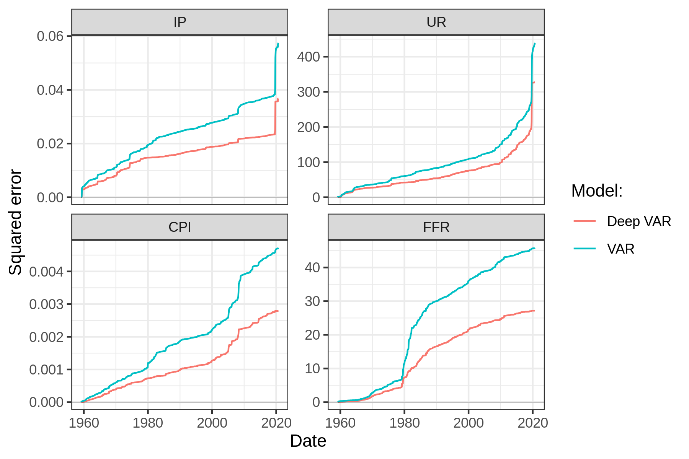

# Empirical results {#empirics}

```{r, include=FALSE}
knitr::opts_chunk$set(
  eval=FALSE,
  echo = FALSE,
  warning=FALSE,
  message=FALSE
)
library(deepvars)
```

```{r, eval=TRUE}
dt <- readRDS("data_VAR/preprocessed.rds")
var_cols <- colnames(dt)[2:ncol(dt)]
```

```{r, eval=TRUE}
# Choosing lags:
max_lags <- 12
lags <- lag_order(dt, max_lag = max_lags)$p
# Deep VAR params:
num_units <- 100
num_layers <- formals(deepvareg)$num_layers
dropout <- formals(deepvareg)$p_drop_out
epochs <- 100
```

```{r}
# VAR fitting
var_model <- vareg(dt, lags = lags)
# Deep VAR fitting
deepvar_model <- deepvareg(
  dt, 
  lags=lags, 
  num_units = num_units, 
  epochs=epochs
)
```

```{r}
# Cum RMSE plot
cum_loss_var <- cum_loss(var_model)$cum_loss[,type:="VAR"]
cum_loss_dvar <- cum_loss(deepvar_model)$cum_loss[,type:="Deep VAR"]
dt_plot <- rbind(cum_loss_dvar, cum_loss_var)
p <- ggplot2::ggplot(data=dt_plot, ggplot2::aes(x=date, y=value, colour=type)) +
  ggplot2::geom_line() +
  ggplot2::facet_wrap(~variable, scales = "free_y") +
  ggplot2::scale_color_discrete(name="Model:") +
  ggplot2::labs(
      x="Date",
      y="Squared error"
    ) +
  geom_hline(aes(yintercept=0), lwd=0.1)
ggsave(
  filename = "www/cum_loss_full.png", 
  plot = p,
  width = 6,
  height = 4
)
```

```{r}
resids <- rbind(
  deepvar_model$res[,model:="Deep VAR"],
  data.table(var_model$res)[,model:="VAR"]
)
resids <- melt(resids, id.vars = "model")
p <- ggplot(data=resids, aes(sample=value)) +
  stat_qq() + stat_qq_line() +
  facet_wrap(model~variable, scales="free_y", nrow=2) +
  labs(
    x="Theoretical",
    y="Sample"
  )
ggsave(
  filename = "www/qqplot_full.png", 
  plot = p,
  width = 8,
  height = 4
)
```

```{r}
lag_max <- 25
ci <- .95
resids_acf <- resids[
  ,
  .(
    acf=stats::acf(value, lag.max = lag_max, plot=FALSE)$acf[,,1], 
    lag=stats::acf(value, lag.max = lag_max, plot=FALSE)$lag[,,1],
    ci=qnorm((1 + ci)/2)/sqrt(.N)
  ),
  by=.(model, variable)
]
p <- ggplot(data=resids_acf, aes(x=lag, y=acf)) +
  geom_hline(aes(yintercept = ci), linetype = "dashed", color = "darkblue") +
  geom_hline(aes(yintercept = 0)) +
  geom_hline(aes(yintercept = -ci), linetype = "dashed", color = "darkblue") +
  geom_segment(mapping = aes(xend = lag, yend = 0)) +
  facet_wrap(model~variable, scales="free_y", nrow=2) +
  labs(
    y="ACF",
    x="Lag"
  ) 
ggsave(
  filename = "www/acf_full.png", 
  plot = p,
  width = 8,
  height = 4
)
```

We now proceed to benchmark the proposed Deep VAR model against the conventional VAR using out macroeconomic time series data. To begin with, we compare both models in terms of their in-sample fit. For this part of the analysis the models will be strictly run under the same framing conditions. Due to the RNN's capacity to essentially model any possible function $f_i(\cdot)$ the Deep VAR dominates the VAR in this realm. We investigate during what time periods the outperformance of the Deep VAR is particurly striking to gain a better understanding of when and why it pays off to relax the linearity constraint.

These findings with respect to in-sample performance provide some initial evidence in favor of the Deep VAR. But since a reduction in modelling bias is typically associated with an increase in variance, we are particularly interested in benchmarking the models with respect to their out-of-sample performance. To this end we split our sample into train and test subsamples. We then firstly benchmark the models in terms of their pseudo out-of-sample fit. Finally we also look at model performance with respect to $n$-step ahead pseudo out-of-sample forecasts.

The final part of this section relaxes the constraint on the framing conditions. In particular, we investigate how hyperparameter tuning with respect to the neural network architecture and lag length $p$ can improve the performance of the Deep VAR.

## In-sample fit

For this first emprical exercise both models are trained on the full sample. We have decided to include the post-Covid sample period despite the associated structural break, since it serves as interesting point of comparison. The optimal lag order as determined by the Akaike Information Criterium is $p=`r lags`$, where we used a maximum possible lag of $p_{\max}=`r max_lags`$ corresponding to one year. The LSTMs underlying the Deep VAR model are composed of $H=`r num_layers`$ that count $N=`r num_units`$ hidden units each. The dropout rate is set to $p=`r dropout`$. 

To assess the fit of our models we use the root mean squared error (RMSE) as our preferred loss function. Figure \@ref(fig:cum-loss-full) shows the cumulative RMSE of both the VAR model and Deep VAR model for each of the time series over the whole sample period. The first thing we can observe is that the RMSE of the Deep VAR is consistently flatter than the RMSE of the VAR. With respect to in-sample performance, the Deep VAR the VAR throughout the entire time period of the experimental analysis and for all of the considered variable. This empirical observation seems to confirm our expectation that the vector autoregressive process is characterized by important non-linear dependencies across time and variables that the conventional VAR fails to capture. 

```{r cum-loss-full, eval=TRUE, fig.cap="Comparison of cumulative loss over the entire sample period for conventional VAR and proposed Deep VAR."}

```

Figure \@ref(fig:cum-loss-full) is especially useful to asses in which specific periods the Deep VAR model achieves better modelling outcomes than the VAR model. From the very beginning and across variables, we observe that the increase in cumulative loss for the VAR model is greater than for the Deep VAR model. The US economy during 1960s was influence by John F. Kennedy's introduction of **New Economics**, which was informed by Keynesian ideas and characterized by increasing levels of inflation, a reduction in unemployment and output growth. The change in government certainly corresponded to a regime switch with respect to the economy [@perry2010economic] and in that sense it is interesting to observe that the Deep VAR appears to be doing a better job at capturing the underlying changes. The 1970s can be broadly thought of as a continuation of New Economicy and loosely defined as a period of stagflation. The Deep VAR continues to outperform the VAR during that period.

The first truly interesting development we can observe in Figure \@ref(fig:cum-loss-full) coincides with the onset of the Volcker disinflation period. Following years of sustained CPI growth, Paul Volcker set the Federal Reserve on course for a series of interest rate hikes as soon as he became chairperson of the central bank in August 1979. The shift in monetary policy triggered fundamental changes to the US economy and in particular the key econmic indicators we are analysing here throughout the 1980s [@goodfriend2005incredible]. Despite this structural break, the increase in the cumulative RMSE of the Deep VAR remains almost constant during this decade for most variables. The performance of the VAR on the other hand is unsurprisingly poor over the same period, in particularly so for the CPI and the Fed Funds Rate, which arguably were the two variables most directly affected by the change in policy. The Deep VAR also clearly dominates the VAR with respect to the output related variables (IP) and to a lesser extent unempoyment. These findings indicate that changes to the monetary transmission mechanism in response to sudden policy shifts are not well captured by a linear-additive vector autoregressive model. Instead they appear to unfold in a high-dimensional latent state space, which the Deep VAR by its very construction is designed to learn.

Following the Volcker disinflation period, Figure \@ref(fig:cum-loss-full) does not reveal any clear outperformance of either of the models during the 1990s. Interestingly the dot-com bubble has little affect on either of the models, aside from a small pick-up in cumulative loss with respect to the CPI for both models. With all that noted, the Deep VAR still continuously outperforms the VAR since evidently its cumulative loss increases at a lower pace alltoghether. 

As the Global Financial Crisis unfolds around 2007 the pattern we observed for the Volcker disinflation reemerges, albeit to a lesser extent: there is a marked jump in the difference between the cumulative loss of the VAR and the Deep VAR, in particular so for the CPI, the Fed Funds rate and industrial production. The gap for all these variables continues to widen during the aftermath of the crisis. The Deep VAR once again does a better job at modelling the changes that the dynamical system undergoes: post-crisis US monetary policy was characterized by very low interest rates, low levels of inflation as well as the introduction of a range of non-conventional monetary policy tools including quantitative easing and forward guidance. 

Finally, it is also interesting to observe how both models perform in response to the  unprecedented exogenous shock that Covid-19 constitutes. Both models incurr huge errors with respect to both IP and UR - the two series most significantly affected by Covid. Evidently though, the magnidtude of the errors is somewhat larger for the VAR than for the Deep VAR. This, once again seems to confirm our hypothesis that the Deep VAR model captures important non-linear dependences across time and variables that the conventional VAR fails to catpure.

As a santiy check we also visually inspected the distributional properties of the model residuals for the full-sample fit. The outcomes are broadly consistent across models: while for some variables residuals are clearly not Gaussian, we see no evidence of serial autocorrelation of residuals. Visualizations can be found in section \@ref(#resids) of the appendix.

\FloatBarrier

## Out-of-sample fit

```{r, eval=TRUE}
#Train test split
train_test_split <- split_sample(dt)
train_data <- train_test_split$train_data
#Select the number of lags
lags <- lag_order(train_data, max_lag = max_lags)$p
```

```{r}
# VAR
var_model <- vareg(train_data, lags = lags)
# Deep VAR
deepvar_model <- deepvareg(
  train_data, 
  lags=lags, 
  num_units = num_units, 
  epochs=epochs
)
```

```{r}
y_true <- var_model$y_train
```

In order to assess if the Deep VAR's outperformance is a consequence of overfitting, we now repeat the previous exercise, but this time we train the models on a subsample of our date. The training sample spans from `r format(min(train_data$date), "%B, %Y")` to `r format(max(train_data$date), "%B, %Y")`, whereas the test data goes from `r format(min(train_test_split$test_data$date), "%B, %Y")` to `r format(max(train_test_split$test_data$date), "%B, %Y")`. This corresponds to training the model on 80 percent of the data and retaining the remaining 20 percent for testing purposes. The optimal lag order for the training subsample is $p=`r lags`$ where we use the same criterion and maximum lag order as before.

```{r}
#VAR
pred_var <- predict(var_model)
p <- plot(pred_var, y_true = y_true)
ggsave("www/pred_var_train.png", width = 7, height = 4)
#DeepVAR
pred_deepvar <- predict(deepvar_model)
p <- plot(pred_deepvar, y_true = y_true)
ggsave("www/pred_dvar_train.png", width = 7, height = 4)
```

```{r}
#Predictions out of sample
X_test <- prepare_test_data(train_test_split, lags=lags)$X_test
y_test <- prepare_test_data(train_test_split, lags=lags)$y_test
#VAR
pred_var <- predict(var_model, X=X_test)
p <- plot(pred_var, y_true = y_test)
ggsave("www/pred_var_test.png", width = 7, height = 4)
#DeepVAR
pred_dvar <- predict(deepvar_model, X=X_test)
p <- plot(pred_dvar, y_true = y_test)
ggsave("www/pred_dvar_test.png", width = 7, height = 4)
```

```{r}
#RMSE 
rmse_var <- rbind(
  rmse(var_model)[,model:="var"][,sample:="train"],
  rmse(var_model, X=X_test, y=y_test)[,model:="var"][,sample:="test"]
)
rmse_dvar <- rbind(
  rmse(deepvar_model)[,model:="deepvar"][,sample:="train"],
  rmse(deepvar_model, X=X_test, y=y_test)[,model:="deepvar"][,sample:="test"]
)
tab_rmse <- rbind(rmse_var, rmse_dvar)
tab_rmse <- data.table::dcast(tab_rmse, sample + variable ~ model, value.var = "value")
tab_rmse[, ratio:= deepvar/var]
saveRDS(tab_rmse, file="results/train_test_tab_rmse.rds")
```

Tables \@ref(fig:tab-rmse) shows ths Root Mean Squared Error (RMSE) for the in-sample and the out-of-sample predictions of both the VAR model and the Deep VAR model. We can see that the RMSE for the Deep VAR outperforms the one for the conventional VAR for both the training data and the test data and for all time series. The fifth column of the table shows us the ratio between the RMSEs of the Deep VAR and the VAR: the lower the ratio, the better the Deep VAR compared to the VAR. With respect to the training sample, the RMSE of the Deep VAR model is consistently less than 75% of that of the conventional VAR reflecting to some extent the results of the previous sections. Turning to the test data, there is no evidence that the Deep VAR is more prone to overfitting than the VAR. For both industrial production and unemployment, the Deep VAR yields an RMSE that is around half the size of that produced by the VAR. For inflation and interest rate predictions the outperformance on the test data is less striking, but still fairly significant.

```{r tab-rmse, fig.cap="Root mean squared error (RMSE) for the two models across subsamples and variables."}
tab_rmse <- readRDS("results/train_test_tab_rmse.rds")
knitr::kable(
  tab_rmse, 
  col.names = c("Sample", "Variable", "DVAR", "VAR", "Ratio (DVAR / VAR)"),
  digits = 5
) 
```


```{r, include=FALSE}
library(xtable)
dtf<- xtable(tab_rmse[, -"Mean"], caption = c("RMS"))
names(dtf) <- c('Sample','Variable', 'DeepVAR', "VAR", "Ratio")
bold <- function(x){
paste('{\\textbf{',x,'}}', sep ='')
}
italic <- function(x){
paste0('{\\emph{ ', x, '}}')
}
print(dtf, sanitize.colnames.function = bold, sanitize.rownames.function = italic, booktabs = TRUE, include.rownames=FALSE)
```

## Forecasts

```{r}
n_ahead <- 12
y_true <- y_test[1:n_ahead,]
```

```{r}
#Forecasts
#VAR
fcst_var <- forecast(var_model, n.ahead = n_ahead)
p <- plot(fcst_var, y_true=y_true, history = 20)
ggsave(filename = "www/fcst_var.png", p, width=7, height=4)
#DeepVAR
fcst_dvar <- forecast(deepvar_model, n.ahead = n_ahead)
p <- plot(fcst_dvar, y_true=y_true, history = 20)
ggsave(filename = "www/fcst_dvar.png", p, width=7, height=4)
```

```{r}
# Correlations
correlations <- function(fcst_var,fcst_dvar,y_true){
  list_names <- c(colnames(y_true))
  cor_var <- c()
  cor_dvar <- c()
  for (n in list_names){
    cor_var <- c(cor_var,cor(fcst_var$fcst[, ..n][-1], y_true[,n]))
    cor_dvar <- c(cor_dvar,cor(fcst_dvar$fcst[, ..n][-1], y_true[,n]))
    
  }
  return(data.table(cor_var,cor_dvar))
}
correlations <- correlations(fcst_var,fcst_dvar,y_true)

# Table
tab_fcst <- data.table(
  "Variable" = colnames(y_true), 
  "VAR RMSFE"= rmsfe(fcst_var, y_true = y_true)[,value] , 
  "Deep VAR RMSFE"= rmsfe(fcst_dvar, y_true = y_true)[,value],
  "VAR correlations" = correlations$cor_var,
  "Deep-VAR correlations" = correlations$cor_dvar
)
saveRDS(tab_fcst, file="results/tab_fcst.rds")
```

Up until now we have been assessing the 1-step ahead predictions of both models. In our context these predictions can be thought of as 1-month ahead nowcasts from a practical perspective. Since real-time nowcasts have grown in popularity during recent years, the results so far should be of great interest to central bankers and other practitioners.
Nonetheless, there is typically also great interest in time series forecasts at longer horizons. We therefore briefly introduce $n$-step ahead pseudo out-of-sample forecasts in this section and revisit them again further below.

Forecasts are produced recursively both for the VAR and the Deep VAR. Specifically, we use the models we trained on the training data to recursively predict one time period ahead, concatenate the predictions to the training data and repeat the process.^[Note that for the Deep VAR an alternative approach would be to work with a different output dimension for the underlying neural networks.]

In the following table, we look more specifically at this comparison. In particular, we compute the Forecast RMSE for the VAR method and for the Deep-VAR, and we also compute the correlation of the forecast with the actual value of each time series.

```{r, eval=TRUE, fig="Comparison of n-step ahead pseudo out-of-sample forecasts."}
tab_fcst <- readRDS("results/tab_fcst.rds")
knitr::kable(tab_fcst, digits=5)
```


As we can see in the table, the Forecast RMSE of the Deep-VAR is lower than the one for the VAR for unemployment rate and for the federal funds rate, and it is the same for industrial production and inflation. Hence, the Deep-VAR outperforms the VAR in terms of forecasts. It is also of interest to analyze the correlation between the forecasts and the actual values. In the case of the VAR, there is, for all time series, a negative correlation, that is, when the time series evolves in one direction, the VAR forecast evolves in the opposite direction. However, this is not true for the Deep-VAR. For industrial production, is certainly true that the Deep-VAR forecast has a highly negative correlation with the actual values, but achives the same forecasting performance than the one for the VAR. However, for the rest of time series, the Deep-VAR has a positive correlation, that is, the forecast generally evolves in the same direction as the actuial values. Note that this positive correlation cannot be too strong given that the forecasts at some point in time return to the mean, and hence, have no varaiability.  


```{r}
dtf<- xtable(tab_fcst, caption = c("Forecasts results"))
print(dtf, sanitize.colnames.function = bold, sanitize.rownames.function = italic, booktabs = TRUE, include.rownames=FALSE,size = "\\setlength{\\tabcolsep}{2pt}")
```


## Hyper parameter tuning

```{r}
# Parameters
n_ahead <- 12
layers <- c(1,2,5)
units <- c(50,100,150)
dropout <- c(0.3,0.5,0.7)
lags <- c(10,50,100)
grid <- data.table::CJ(
  layer = layers,
  unit = units,
  dropout = dropout
)
n_sim <- length(lags) * grid[,.N]
```

```{r}
# Train test:
train_test_split <- split_sample(dt)
train_data <- train_test_split$train_data
```

```{r, eval=FALSE}
grid_search <- rbindlist(
  lapply(
    1:length(lags),
    function(lag_idx) {
      
      p <- lags[lag_idx]
      
      message(sprintf("Running for lag=%i", p))
      
      # For given lag fit VAR:
      var_model <- vareg(train_data, lags = p) 
      y_true <- var_model$y_train
      
      # Test data:
      X_test <- prepare_test_data(train_test_split, lags=p)$X_test
      y_test <- prepare_test_data(train_test_split, lags=p)$y_test
      y_true_fcst <- y_test[1:n_ahead,]
      
      # Enter loop for Deep VAR:
      results <- rbindlist(
        lapply(
          1:nrow(grid),
          function(i) {
            
            list2env(c(grid[i,]), envir = environment()) # retrieve parameters
            
            pct_done <- ( ( (lag_idx-1)*grid[,.N] + i ) / n_sim ) * 100
            message(sprintf("Percent done: %0.2f", pct_done))
            
            # Fit Deep VAR model
            deepvar_model <- deepvareg(
              train_data, 
              lags=p, 
              num_units = unit,
              num_layers = layer,
              epochs=100,    
              p_drop_out = dropout
            )
            
            # Train RMSE
            train_rmse <- rbind(
              rmse(deepvar_model)[,model:="dvar"][,measure:="rmse"][,sample:="train"],
              rmse(var_model)[,model:="var"][,measure:="rmse"][,sample:="train"]
            )
            
            # Test RMSE
            test_rmse <- rbind(
              rmse(
                deepvar_model, X=X_test, y=y_test
              )[,model:="dvar"][,measure:="rmse"][,sample:="test"],
              rmse(
                var_model, X=X_test, y=y_test
              )[,model:="var"][,measure:="rmse"][,sample:="test"]
            )
            
            # Forecasts RMSE
            fcst_dvar <- forecast(deepvar_model, n.ahead = n_ahead)
            fcst_var <- forecast(var_model, n.ahead = n_ahead)
            fcst_rms <- rbind(
              rmsfe(
                fcst_dvar, y_true = y_true_fcst
              )[,model:="dvar"][,measure:="rmsfe"][,sample:="test"],
              rmsfe(
                fcst_var, y_true = y_true_fcst
              )[,model:="var"][,measure:="rmsfe"][,sample:="test"]
            )
            
            # Forecasts correlations:
            fcst_corr <- rbind(
              cor_fcst(
                fcst_dvar, y_true = y_true_fcst
              )[,model:="dvar"][,measure:="corr"][,sample:="test"],
              cor_fcst(
                fcst_var, y_true = y_true_fcst
              )[,model:="var"][,measure:="corr"][,sample:="test"]
            )
            
            # Put together:
            results <- rbind(
              train_rmse, 
              test_rmse, 
              fcst_rms, 
              fcst_corr
            )
            
            # Assign remaining variables:
            results[,lag:=p]
            results[,num_layer:=layer]
            results[,num_units:=unit]
            results[,dropout:=dropout]
            
            return(results)
          }
        )
      )
      
      return(results)
      
    }
  )
)
saveRDS(grid_search, "results/grid_search.rds")
```


