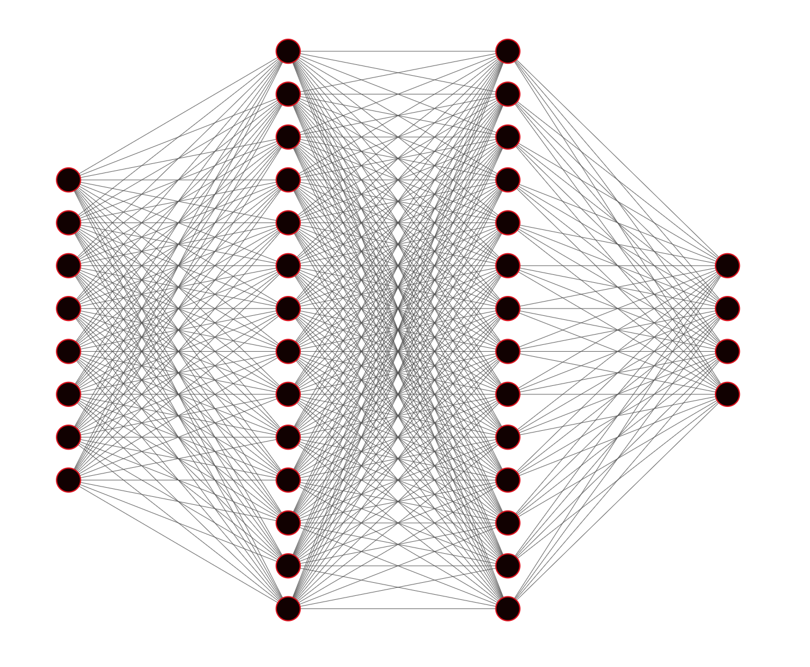

# Methodology {#methodology}

In conventional Vector Autoregression (VAR) dependencies of any system variable on past realizations of itself and its covariates are modelled through linear equations. This corresponds to a particular case of the broader class of Deep Vector Autoregressions investigated here and will serve as the baseline for our analysis.

## Vector Autoregression {#var}

Let $\mathbf{y}_t$ denote the $(K \times 1)$ vector of variables at time $t$. Then the VAR($p$) with $p$ lags and a constant deterministic term is simply a linear system of stochastic equations of the following form:

\begin{equation} 
\begin{aligned}
&& \mathbf{y}_t&=\mathbf{c} + \mathbf{A}_1 \mathbf{y}_{t-1} + \mathbf{A}_2 \mathbf{y}_{t-2} + ... + \mathbf{A}_p \mathbf{y}_{t-p} + \mathbf{u}_t \\
\end{aligned}
(\#eq:redform)
\end{equation}

The matrices $\mathbf{A}_m \in \mathbb{R}^{K \times K}$, where $m\in\{1,...,p\}$, contain the reduced form coefficients and $\mathbf{u}_t \in \mathbb{R}^{K \times1}$ is a vector of errors for which $\mathbb{E}\mathbf{u}_t$, $\mathbb{E}\mathbf{u}_t\mathbf{u}_t^T=\Sigma$ and $\mathbb{E}\mathbf{u}_t\mathbf{u}_s^T=\mathbf{0}$ for all $t\ne s$. We refer to \@ref(eq:redform) as the **reduced form** representation of the VAR($p$) because all right-hand side variables are predetermined [@kilian2017structural]. 

We can restate \@ref(eq:redform) more compactly as 

\begin{equation} 
\begin{aligned}
&& \mathbf{y}_t&=\mathbf{A} \mathbf{Z}_{t-1} + \mathbf{u}_t \\
\end{aligned}
(\#eq:sur)
\end{equation}

where $\mathbf{A}=(\mathbf{c},\mathbf{A}_1,\mathbf{A}_2,...,\mathbf{A}_p) \in \mathbb{R}^{K \times (Kp+1)}$ and $\mathbf{Z}_{t-1}=(1,\mathbf{y}_{t-1}^T,...,\mathbf{y}_{t-p}^T)^T \in \mathbb{R}^{(Kp+1)\times1}$. The expression in \@ref(eq:sur) demonstrates that the VAR($p$) can be considered as a **seemingly unrelated regression** (SUR) model composed of individual regressions with common regressors [@greene2012econometric]. In fact, it is useful to note for our purposes that the VAR($p$) can be estimated efficiently through equation-by-equation OLS regression. In particular, it follows from \@ref(eq:sur) that

\begin{equation} 
\begin{aligned}
&& y_{it}&=c_i+\sum_{m=1}^{p}\sum_{j=1}^{K}a_{jm}y_{jt-m}+u_{it}&&,&&\forall i=1,...,K\\
\end{aligned}
(\#eq:single-var)
\end{equation}

which corresponds to the key modelling assumption that at any point in time $t$ any time series $i\in1,...,K$ is just a weighted sum of past realizations of itself and all other variables in the system. This assumption makes the estimation of VAR($p$) processes remarkably simple. Perhaps more importantly, the assumption of linearity also greatly facilitates inference about VARs. 

For implementation purposes it is generally more useful to estimate the VAR($p$) through one single OLS regression. To this end let $\mathbf{\tilde{A}}=\mathbf{A}^{T}$ and note that \@ref(eq:sur) can be restated even more compactly as 

\begin{equation} 
\begin{aligned}
&& \mathbf{y}&=\mathbf{Z} \mathbf{\tilde{A}} +  \mathbf{u}_t \\
\end{aligned}
(\#eq:var-ols)
\end{equation}

with $\mathbf{y}=(\mathbf{y}_1,...,\mathbf{y}_T)^T \in \mathbb{R}^{T \times K}$ and $\mathbf{Z} \in \mathbb{R}^{T \times (Kp+1)}$. Then the closed form solution for OLS is simply $\mathbf{\tilde{A}}=(\mathbf{Z}^T\mathbf{Z})^{-1}\mathbf{Z}^T\mathbf{y}$ and hence

\begin{equation} 
\begin{aligned}
&& \mathbf{A}&=\mathbf{y}^T\mathbf{Z}(\mathbf{Z}\mathbf{Z}^T)^{-1} \\
\end{aligned}
(\#eq:ols-sol)
\end{equation}

## Deep Vector Autoregression {#deepvar}

We propose the term Deep Vector Autoregression to refer to the broad class of Vector Autoregressive models that use deep learning to model the dependences between system variables through time. In particular, as before, we let $\mathbf{y}_t$ denote the $(K \times 1)$ vector that describes the state of system at time $t$. Consistent with the conventional VAR structure we assume that each individual time series $y_{it}$ can be modelled as a function of lagged realizations of all variables $y_{jt-p}$, $j=1,...,K$, $m=1,...,p$. More specifically, we have 

\begin{equation} 
\begin{aligned}
&& y_{it}&=f_i\left(\mathbf{y}_{t-1:t-p};\theta\right)+v_{it} &&,&&\forall i=1,...,K \\
\end{aligned}
(\#eq:single-dvar)
\end{equation}

where $\mathbf{y}_{t-1:t-p}=\left\{y_{jt-m}\right\}^{m=1,...,p}_{j=1,...,K}$ is the vector of lagged realizations, $f_i$ is a variable specific mapping from past lags to the present and $\theta$ is a vector of parameters. While in the conventional VAR above we assumed that the multivariate process can be modelled as a system of linear stochastic equations, our proposed Deep VAR($p$) can similarly be understood as a system of potentially highly non-linear equations. As we argued earlier, Deep Learning has been shown to be remarkably successful at learning mappings of arbitrary functional forms [@goodfellow2016deep]. 

Note that the input and output dimensions in \@ref(eq:single-dvar) are exactly the same as in the conventional VAR($p$) model (equation \@ref(eq:single-var)): $f_i$ maps from $\mathbf{y}_{t-1:t-p} \in \mathbb{R}^{Kp \times1}$ to a scalar. Our proposed plain-vanilla approach to Deep VARs diverges as little as possible from the conventional approach: it boils down to simply modelling each of the univariate outcomes in \@ref(eq:single-dvar) as a deep neural network. We can restate this approach more compactly as 

\begin{equation} 
\begin{aligned}
&& \mathbf{y}_t&= \mathbf{f}(\mathbf{y}_{t-1:t-p};\theta) + \mathbf{v}_t \\
\end{aligned}
(\#eq:dvar)
\end{equation}

where $\mathbf{f}(\cdot)=(f_1(\cdot), f_2(\cdot),...,f_K(\cdot))^T \in \mathbb{R}^{K \times1}$ is just the stacked vector of mappings to univariate outcomes described in \@ref(eq:single-dvar).

The notation in \@ref(eq:dvar) gives rise to a more unified and general approach to Deep VARs that would treat the whole process as one single dynamical system to be modelled through one deep neural network $\mathbf{g}$:

\begin{equation} 
\begin{aligned}
&& \mathbf{y}_t&= \mathbf{g}(\mathbf{y}_{t-1:t-p};\theta) + \mathbf{v}_t \\
\end{aligned}
(\#eq:dvar-uni)
\end{equation}

This approach is in fact proposed and investigated by @verstyuk2020modeling in his upcoming publication. We decided to go with the approach in \@ref(eq:dvar) for two reasons: firstly, the link to conventional VARs is made abundantly clear through this implementation and, secondly, we found that the equation-by-equation approach produces good modelling outcomes and is relatively easy to implement using state-of-the art software.

Finally, note that if $f_i$ in \@ref(eq:single-var) is assumed to be linear and additive for all $i=1,...,K$ then we are back to the conventional VAR($p$). This illustrates the point we made earlier that the linear VAR($p$) is just a particular case of a Deep VAR($p$). Since the model described in equations \@ref(eq:single-dvar) and \@ref(eq:dvar) is less restrictive but otherwise consistent with the conventional VAR framework, we expect that it outperforms the traditional approach towards modelling multivariate time series processes.

## Deep Neural Networks - a whistle-stop tour

So far we have been speaking about deep learning in rather general terms. For example, above we have referred to our model of choice for learning the mapping $f_i: \mathbf{y}_{t-1:t-p} \mapsto y_{it}$ as a **deep neural network**. The class of deep neural networks can further be roughly divided into **feedforward neural networks** and **recurrent neural networks**. As the term suggests, the latter is generally used for sequential data and therefore our preferred model of choice. Nonetheless, below we will begin by briefly exploring feedforward neural networks first. This should serve as a good introduction to neural networks more generally and (even though we have not tested this empirically) there is good reason to believe that even Deep VARs using feedforward neural networks perform well.

### Deep Feedforward Neural Networks

The term **deep feedforward neural network** or **multilayer perceptron** (MLP) is used to describe a broad class of models that are composed of possibly many functions that together make up the directed acyclical graph. The functions $f_i(\cdot)$ - sometimes referred as layers $\mathbf{h}_{i}$ - are chained together hierarchically with the first layer feeding forward its outputs to the second layer and so on [@goodfellow2016deep]. Applied to our case, an MLP with $H$ hidden layers can be loosely defined as follows:

\begin{equation} 
\begin{aligned}
&& f_i(\mathbf{y}_{t-1:t-p};\theta)&=f_i^{(H)}\left(f_i^{(H-1)}\left(...f_i^{(1)}\left(\mathbf{y}_{t-1:t-p}\right)\right)\right) \\
\end{aligned}
(\#eq:mlp)
\end{equation}

The depth of the MLP is defined by the number of hidden layers $H$, where, generally speaking, deeper networks are more complex. 

The desired outputs of any $f_i^{(h)}$ that will serve as inputs for $f_i^{(h+1)}$ cannot be inferred from the training data $\mathbf{y}_{t-1:t-p}$ ex-ante, which is where the term **hidden** layer stems from. Each $f_i^{(h)}$ is typically valued on a vector of hidden units, each of them receiving a vector of inputs from $f_i^{(h-1)}$ and returning a scalar that is referred to as activation value. This approach is inspired by neuroscience, hence the term **neural** network [@goodfellow2016deep].

### Deep Recurrent Neural Networks

**Recurrent neural networks** (RNN) are based on the idea of persistent learning: a continuous process that evolves gradually and at each step uses information about its prior states instead of continuously reinventing itself and starting from scratch. To this end, RNNs develop the basic concepts underlying feedforward neural networks by incorporating feedback loops. Formally the loop is typically made explicit as follows

\begin{equation} 
\begin{aligned}
&& \mathbf{h}_t&=f(\mathbf{h}_{t-1},\mathbf{x}_t;\theta) \\
\end{aligned}
(\#eq:hidden-state)
\end{equation}

where $\mathbf{h}_t \in \mathbb{R}^{N \times1}$ corresponds to the hidden state of the dynamical system at time $t$ that the RNN learns [@goodfellow2016deep], and $N$ corresponds to the number of hidden units in each hidden layer, known as the width of the layer. In the given context we have that $\mathbf{x}_t=\mathbf{y}_{t-1:t-p}$ as specified in \@ref(eq:dvar). Given some random initial hidden state vector $\mathbf{h}_0$ the RNN updates parameters sequentially at each time step $t$ as follows

\begin{equation} 
\begin{aligned}
&& \mathbf{a}_t&=\mathbf{b} + \mathbf{W}\mathbf{h}_{t-1} + \mathbf{U}\mathbf{h}_{-1} \\
&& \mathbf{h}_{t}&=\tanh(\mathbf{a}_t) \\
&& \mathbf{\hat{y}}_t&=\mathbf{c} + \mathbf{V}\mathbf{h}_t\\
\end{aligned}
(\#eq:rnn)
\end{equation}

where $\mathbf{b} \in \mathbb{R}^{N \times1}$ and $\mathbf{c} \in \mathbb{R}^{K \times1}$ are vectors of constants (biases), $\tanh$ is the hyperbolic tangent activation function and $\mathbf{W}$, $\mathbf{U}$, $\mathbf{V}$ are coefficient matrices, where $\mathbf{W},\mathbf{U} \in \mathbb{R}^{N \times N}$ and $\mathbf{V} \in \mathbb{R}^{K \times N}$. Note that to simplify the notation we have omitted the layer index in \@ref(eq:rnn): to be specific, $\mathbf{h}_t$ really represents $\mathbf{h}^{(H)}_t$ (the ultimate hidden layer), $\mathbf{h}_{-1}$ stands for $\mathbf{h}^{(H-1)}_t$ (the penultimate layer). Finally, at each step $t$ the first layer $\mathbf{h}^{(0)}_t$ of the forward propagation corresponds to $\mathbf{y}_{t-1:t-p}$. 

A shortfall of generic recurrent neural networks is that they fail to capture long-term dependencies. More specifically, if parameters are propagated over too many stages in a simple RNN, it typically suffers from the problem of **vanishing gradients** [@goodfellow2016deep]. Fortunately, there exist effective extensions of the RNN, most notably the long short-term memory (LSTM), which was introduced by @hochreiter1997long and is our model of choice for Deep VARs. The key idea underlying LSTMs is to regulate exactly how much information is propagated from one cell state vector $\mathbf{C}_{t-1}$ to the next $\mathbf{C}_{t}$ through the introduction of so called sigmoid gates:


> "The LSTM [has] the ability to remove or add information to the cell state, carefully regulated by structures called gates. Gates are a way to optionally let information through."
--- @olah2015understanding

These regulating gate layers include a **forget gate** $\mathbf{f}_t$, an **input gate** $\mathbf{i}_t$ and a **output gate** $\mathbf{o}_t$. Each of them are vector-values sigmoid functions whose elements $\mathbf{f}_{it},\mathbf{i}_{it},\mathbf{o}_{it}$ are bound between $0$ and $1$. Their individual purposes are implied by their names: faced with $\mathbf{h}_{t-1}$ and $\mathbf{y}_{t-1:t-p}$, the forget gate regulates how much of each individual unit in $\mathbf{C}_{t-1}$ is retained. Then the input gate regulates which units of $\mathbf{C}_{t-1}$ should be updated and to what candidate values $\mathbf{\tilde{C}}_{t-1}$. Using the previous two steps the actual update is performed according to the following rule

\begin{equation} 
\begin{aligned}
&& \mathbf{C}_{t}&=\mathbf{f}_t \odot \mathbf{C}_{t-1} + \mathbf{i}_t \odot \mathbf{\tilde{C}}_{t-1}\\
\end{aligned}
(\#eq:lstm-update)
\end{equation}

where $\odot$ indicates the element-wise product. Finally, the output gate acts like a filter on $\mathbf{C}_{t}$: the new hidden state is computed as $\mathbf{h}_{t}=\mathbf{o}_t \odot \tanh (\mathbf{C}_{t})$ where as before we use the hyperbolic tangent as our activation function.^[For a clear and detailed exposition see @olah2015understanding.] Formally, we can summarize the LSTM neural network underlying our Deep VAR framework as follows:

\begin{equation} 
\begin{aligned}
&& \mathbf{f}_t&=\sigma \left( \mathbf{b}_f + \mathbf{W}_f\mathbf{h}_{t-1} + \mathbf{U}_f\mathbf{h}_{-1} \right) \\
&& \mathbf{i}_t&=\sigma \left( \mathbf{b}_i + \mathbf{W}_i\mathbf{h}_{t-1} + \mathbf{U}_i\bf{h}_{-1} \right) \\
&& \mathbf{o}_t&=\sigma \left( \mathbf{b}_o + \mathbf{W}_o\mathbf{h}_{t-1} + \mathbf{U}_o\mathbf{h}_{-1} \right) \\
&& \mathbf{C}_t&=\mathbf{f}_t \odot \mathbf{C}_{t-1} + \mathbf{i}_t \odot \tanh \left( \mathbf{b}_C + \mathbf{W}_C\mathbf{h}_{t-1} + \mathbf{U}_C\mathbf{h}_{-1} \right) \\
&&\mathbf{h}_{t}&=\mathbf{o}_t \odot \tanh (\mathbf{C}_t) \\
&& \mathbf{\hat{y}}_t&=\mathbf{c} + \mathbf{V}\mathbf{h}_t\\
\end{aligned}
(\#eq:lstm)
\end{equation}

which is best understood when read from top to bottom. Once again we have simplified the notation by omitting the layer index in \@ref(eq:rnn). The same notation as before applies.

## Model selection

There are at least two important modelling choices to be made in the context of conventional VARs. The first choice concerns properties of the time series data itself, in particular the order of integration and cointegration. The second choice is about the the lag order $p$. In order to arrive at appropriate decisions regarding these choices the VAR literature provides a set of guiding principles. We propose to apply these same principles to the Deep VAR, firstly because they are intuitive and simple and secondly because treating both models equally to begin with allows for a better comparison of the two models at the subsequent modelling stages.

### Stationarity {#stationarity}

When working with time series we are generally concerned about stationarity. Broadly speaking stationarity ensures that the future is like the past and hence any predictions we make based on past data adequately describe future outcomes. In order to state stationarity conditions in the VAR context it is convenient to restate the $K$-dimensional VAR($p$) process in companion form as

\begin{equation} 
\begin{aligned}
&& \mathbf{Y}_t&= \begin{pmatrix}
 \mathbf{c} \\
0 \\
\vdots \\
0 \\
\end{pmatrix} + \mathbf{A} \mathbf{Y}_{t-1} + \begin{pmatrix}
 \mathbf{u}_t \\
0 \\
\vdots \\
0 \\
\end{pmatrix}  \\
\end{aligned}
(\#eq:companion)
\end{equation}

where $\mathbf{Y}_t=(\mathbf{y}_t^T,...,\mathbf{y}^T_{t-p+1})^T \in \mathbb{R}^{Kp \times1}$ and $\mathbf{A} \in \mathbb{R}^{Kp \times Kp}$ is referred to as the companion matrix [@kilian2017structural]. Stationarity of the VAR($p$) follows from stability: a VAR($p$) is stable if the effects of shocks to the system eventually die out. Stability can be assessed through the system's autoregressive roots or equivalently by looking at the eigenvalues of the companion matrix $\mathbf{A}$ [@kilian2017structural]. In particular, for the VAR($p$) in \@ref(eq:companion) to be stable we condition that the $Kp$ eigenvalues $\lambda$ that satisfy 

$$
\begin{aligned}
&& \det (\mathbf{A} - \lambda \mathbf{I}_{Kp})&=0 \\
\end{aligned}
$$

are all of absolute value less than one. Stability implies that the first and second moments of the VAR($p$) process are time-invariant, hence ensuring weak stationarity [@kilian2017structural]. 

A straight-forward way to deal with stationarity of VARs is to simply ensure that the individual time series entering the system are stationary. This usually involves differencing the time series until they are stationary: for any time series $y_i$ that is integrated of order $I(\delta)$, there exists a $\delta$-order difference that is stationary. An immediate drawback of this approach is the loss of information contained in the levels of the time series. Modelling approaches that take into account conintegration of individual time series can ensure system stationarity and still let individually non-stationary time series enter the system in levels [@hamilton1994time]. 

### Lag order

The VARs lag order $p$ can to some extent be thought of as the persistency of the process: past innovations that still affect outcomes in time $t$ happened at most $p$ periods ago. From a pure model selection perspective we can also think of additional lags in terms of additional regressors that add to the model's complexity. From that perspective, choosing a lower lag order corresponds to a form of regularization as it pertains to a more parsimonious model.

Various strategies have been proposed to estimate the true or optimal lag order $p$ empirically [@kilian2017structural]. Among the most common ones are sequential testing procedures and selection based on information criteria. The former involves sequentially adding or removing lags - **bottom-up** and **top-down** testing, respectively - and then testing model outcomes in each iteration. A common point of criticism of sequential procedures is that the order tests matters (@lutkepohl2005new).
 
Here we will focus on selection based on information criteria, which to some extent makes the trade-off between bias an variance explicit [@kilian2017structural]. In particular, it generally involves minimizing information criteria of the following form

\begin{equation} 
\begin{aligned}
&& C(m)&= \log(\det(\hat\Sigma(m))) + \ell(m)\\
\end{aligned}
(\#eq:ic)
\end{equation}

where $\hat\Sigma$ is just the sample estimate of the covariance matrix or errors and $\ell$ is a loss function that penalizes high lag orders. In particular, we have that our best estimate of the optimal lag order $p$ is simply

\begin{equation} 
\begin{aligned}
&& \hat{p}&=\arg\min_{m\in\mathcal{P}}C(m) \\
\end{aligned}
(\#eq:ic-min)
\end{equation}

where $\mathcal{P}=[m_{\min},m_{\max}]$. We will consider all of the most common functional choices for \@ref(eq:ic).

### Neural Network Architecture

By now it should be clear that deep neural networks come in many shapes and sizes. When thinking about the architecture of a neural network many different design choices can be made and networks can thus be tailored to specific use cases. Here, we intend to keep things simple and vary only the depth and width of the LSTMs underlying the Deep VAR. The number of hidden units per hidden layer is held constant across layers. 

Figure \@ref(fig:nn-arch) illustrates the network architecture for the case of two lags ($p=2$) and four variables ($K=4$). We can see that the first layer corresponds to the inputs, that is, the input layer $\in \mathbb{R}^{Kp \times1}$. This architecture consists of $H=2$ hidden layers each counting fourteen hidden units. Given that we are aiming at predicting four variables the output layer consists of four units. The edges illustrate the flow of information of the network, where each edge has an associated weight. 

With respect to network compilation, the popular Adam optimization algorithm is used [@kingma2014adam]. This algorithm can be used instead of the more traditional stochastic gradient descent to update network weights. There are several reasons to use this algorithm that are particularly appealing, among them its straightforward implementation and its computationally efficiency. Adam distinguishes itself from classic stochastic gradient descent in that it uses adaptive learning rates.

```{r nn-arch, eval=TRUE, fig.cap="Neural Network Architecture.", echo=FALSE}

```

As mentioned above, the estimation of deep neural networks involves a very large number of parameters and hence regularization is an important concern especially so when deal. One way to mitigate the risk of overfitting is to choose a neural network architecture that is neither excessively wide nor deep. Another way to regularize the neural network is to use the fact that optimization at the training phase is stochastic. One greedy way to reduce overfitting risk is therefore to simply retrain the network multiple times and then average over the obtained parameter estimates and predictions [@srivastava2014dropout]. While theoretically appealing, this approach is computationally prohibitive. Instead, another layer of stochasticity can be introduced at the training stage through **dropout**: at each training iteration and each stage of the forward propagation a share of the hidden units is simply dropped at random. This approach mimics the idea of repeated training. Dropout adds noise into the model and thereby avoids that hidden layers try to adapt to a mistake made by previous hidden layers. 


