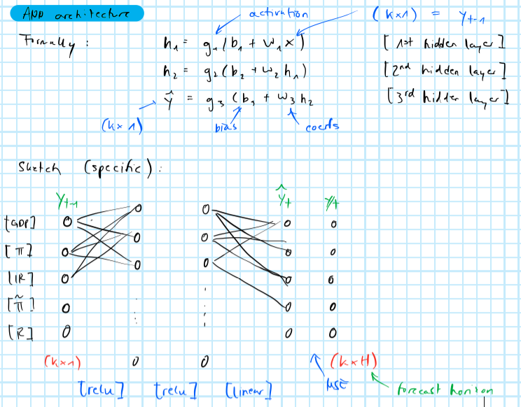

```{r setup, include=FALSE}
knitr::opts_chunk$set(echo = TRUE)
library(ggplot2)
```

# Literature review

## @bussmann2020neural

### Motivation

- In many time series applications the functional dependence of some variable $X_t^{(i)}$ on past lags of some other variable $X_t^{(j)}$ can be expected to be non-linear.
- At the same time, dependencies with respect to multiple covariates can usually be modelled well through additive models (e.g. VAR). 

### Methodology

- Propose a Neural Additive Vector Autoregression (NAVAR) model for causal discovery in time series data
- Let the equation below denote the standard linear VAR where each variable in the system depends linearly on its own lags and those of its covariates:

```{=tex}
\begin{equation}
\begin{aligned}
&& {\mathbf{X}_t}^{(j)}&=\beta^j+ \sum_{i=1}^{N} \sum_{k=1}^{K} [A_k]_{ij} {\mathbf{X}_{t-k}}^{(i)} + \eta_t^j\\
\end{aligned}
(\#eq:var)
\end{equation}
```

```{definition, name="Granger causality"}
Variable $X^{(i)}$ is said to Granger cause another variable $X^{(j)}$ if the past of the set of all (input) variables $\{X_{<t}^{(1)},...,X_{<t}^{(i)},...,X_{<t}^{(N)}\}$ yields better predictions of $X^{(j)}$ then if $X_{<t}^{(i)}$ was excluded.
```

- The NAVAR model instead allows for non-linear interactions between covariates where $f_{ij}$ is the $i$-th output from a deep neural network that maps from all of $j$-th past lags (up to $K$) to all covariates:

```{=tex}
\begin{equation}
\begin{aligned}
&& {\mathbf{X}_t}^{(j)}&=\beta^j+ \sum_{i=1}^{N} f_{ij} \left( {\mathbf{X}_{t-K:t-1}}^{(i)} \right) + \eta_t^j\\
\end{aligned}
(\#eq:navar)
\end{equation}
```

- Notice that if $f$ is linear we are just back to the simple VAR case.

{width="500"}

- In order to make the contributions comparable, every individual time series is normalized such that it has mean zero and standard deviation one before training.

### Experiments

#### Toy data set

#### CauseMe data sets

- where the performance of most methods declines as the number of variables N increases, the performance of NAVAR does not decrease.

# @verstyuk2020modeling

## Intro

- As in @bussmann2020neural, @verstyuk2020modeling introduce deep learning in the context of modelling multiple time series, since it allows for accounting for non-linear relationships. In addition to that @verstyuk2020modeling points out that the deep learning can be used to detect state-dependent dynamics in an unsupervised manner. 
- The empirical framework used here is a Multivariate Recurrent Neural Network (MRNN). While it is slightly different to the NAVAR model, it shares certain familiarities. For example, as with NAVAR, the simple linear VAR can once again be viewed as a specific case of the MRNN.

> "More recently, ANNs have been used for estimation of causal relationships (Hartford et al., 2016; Farrell et al., 2019)"
---@verstyuk2020modeling

## Contributions

- MRNN outperforms VAR by about 8% in terms of prediction accuracy.
- Impulse response analysis using the MRNN yields more intuitive qualitative results than the VAR. For example, monetary policy tightening unambiguously leads to a decrease in output, while for the VAR output initially accelerates. 
    - VAR usually requires careful introductions of identification restrictions beyond the recursive ordering and Cholesky decomposition, while the MRNN appears to learn those restrictions on its own.


## Data

- Much like in our paper here @verstyuk2020modeling looks at US macroeconomic indicators at monthly frequency. 
- Real GDP, seasonally adjusted annual rate, and GDP Price Deflator, seasonally adjusted (both at quarterly frequency)10; Equal Weight Continuous Commodity Index (at daily frequency); Effective Fed Funds Rate and Non-borrowed Reserves (at monthly frequency)
- Data are transformed as follows: Real GDP, GDP Deflator and Commodity Price Index into month-over-month growth rates; Non-borrowed Reserves into monthly differences.
- Covid is excluded and data is split into three subsamples: training sample (1959-2011), validation sample (2011-2015) and testing sample (2015-).

## Methodology

- Preferred MRNN architecture involves just 2 hidden layers with 820 units upstream and 660 units downstream. The preferred VAR model has $k=3$ lags. 
- As for the choice of $M$ and $H$, the number of hidden layers and units, respectively, there are no strict rules. In general though, as both $M$ and $H$ increase, the complexity (or capacity) of the neural network grows. A guiding principle with respect to overfitting risk is to choose parameter values that yield good out-of-sample forecasting performance.
- Regularization methods employed include dropout and data augmentation. In the former, noise is introduced by dropping observations while in the latter synthetic observations are added.

> Data standardization is useful in many statistical learning problems, but in the context of NNs it is even more critical. One development of the general standardization idea that is tailored for NNs is separately standardizing the inputs to intermediate hidden layers (“batch normalization”, see Ioffe and Szegedy, 2015).
---@verstyuk2020modeling

> Here we have sequential data, i.e. each observation is dependent on other observations
immediately prior to it. Hence, one training example includes several (specifically, 24)
consecutive observations: $\{y_{t-i}\}_{i=0}^{23}$.
Predictions over the validation and testing sub-samples are made multiple steps ahead. Non-linearity of NNs warrants direct—as opposed to iterated—forecasts for each point in the prediction horizon.12 Each sub-sample is split in half and predictions are 24-steps- ahead, thus reserving 2 × 24 months for validation and 2 × 24 months for testing.
We use the “golden-standard” mini-batch gradient descent, with 4 training examples
per batch. Then, 1 training epoch is composed of a full run through the training data
set, thus feeding the training examples for all possible $t$: $\{\{y_{t-i}\}_{i=0}^{23}\}_{t=24}^629$.
---@verstyuk2020modeling



> The minimization algorithm used is “adaptive moment estimation”, or Adam (Kingma and Ba, 2014). Each architecture is trained for 10 epochs, with a decaying learning rate. Lastly, the dropout probability is set at 0.2.
---@verstyuk2020modeling

- For lag-length selection for the VAR they use the guiding principle with respect to out-of-sample forecasting performance instead of traditional methods based on information criteria.


# Our data

# Empirical work

## Reduced form VAR analysis

```{r}
library(data.table)
dt <- fread("data_VAR/preprocessed.csv")
```

Here I will use my `SVAA` package to run a couple of standard analyses in the VAR context.

### Sanity checks

```{r}
p <- 12
```

First, let us check if the VAR is stable. For this, I first run the reduced-form VAR with a conventional (?) choice of $p=12$ lags (reflecting `r p/12` year given the monthly frequency).

```{r, echo=TRUE}
library(SVAA)
countries <- dt[,unique(country)] # run analysis by country
var_conventional <- lapply(
  countries,
  function(country) {
    dt_mod <- copy(dt)
    dt_mod <- dt_mod[country==country][,country:=NULL][,date:=NULL] # retain only VAR variables
    var <- VAR(dt_mod, lag=p)
    return(var)
  }
)
names(var_conventional) <- countries
```

Running the test I find that with the conventional choice, the VAR is not stable for the US.

```{r}
sapply(var_conventional, VAR_stable)
```

Let's instead try lag-length selection first. Here, for the US, the more conservative measures suggest using just 5 lags while the less conservative AIC suggest using 10. A reasonable choice seems to be $p=6$ reflecting half a year.

```{r, warning=FALSE}
lag_selection <- lapply(
  countries,
  function(country) {
    dt_mod <- copy(dt)
    dt_mod <- dt_mod[country==country][,country:=NULL][,date:=NULL] # retain only VAR variables
    lag_selection <- VAR_lag_select(dt_mod)
    return(lag_selection)
  }
)
names(lag_selection) <- countries
lag_selection[["US"]]$proposed_lag_lengths
```

So, let's rerun the reduced-form VAR for the new choice of $p$.

```{r}
p <- 6
vars <- lapply(
  countries,
  function(country) {
    dt_mod <- copy(dt)
    dt_mod <- dt_mod[country==country][,country:=NULL][,date:=NULL] # retain only VAR variables
    var <- VAR(dt_mod, lag=p)
    return(var)
  }
)
names(vars) <- countries
```

For the US, the VAR is now stable.

```{r}
sapply(vars, VAR_stable)
```


### Reduced-form IRFs

Below I produce reduced-form IRFs with respect to the interest rate. Confidence bands are computed using bootstrapped standard errors. The results are not intuitive: the CPI increases in response to a shock to the interest rate, output falls but not significantly while unemployment seems completely unaffected.

```{r}
n_ahead <- 36
country <- "US"
irf_IR <- irf(
  vars[[country]], 
  imp = "IR",
  structural = F, 
  n_ahead = 36,
  n_bootstrap = 100
)
```


### Granger causality

> We should also check for Granger causality as in Bussmann. The latter needs to be added to the package functioanlity.
--- Pat

### Forecasts 

Now let's look at forecasts for the economic indicators. I'm running an example for the US below, forecasting out to the conventional policy horizon of three years.

> Here we probably want to do some performance comparison with respect to in-sample and pseudo-out-of-sample forecasts of VAR vs. NAVAR using D Miliano (DM) - or whatever this test is called.
--- Pat

```{r}
my_pred = VAR_predict(vars[[country]], n.ahead=n_ahead, plot = T, theme = theme_bw())
```

### Structural IRFs

> Running simple Cholesky-decomposed GIRF. Haven't taken ordering of variables into account though.
--- Pat

```{r}
irf_IR <- irf(
  vars[[country]], 
  imp = "IR",
  structural = TRUE, 
  n_ahead = 36,
  n_bootstrap = 100
)
```

### FEVD

```{r, fig.dim=c(7,4)}
fevd_output = fevd(vars[[country]])
fevd_output$plot
```

### Historical decomposition

```{r, fig.dim=c(7,4), eval=FALSE}
hd(varresult = vars[[country]])
```

# References {-}

