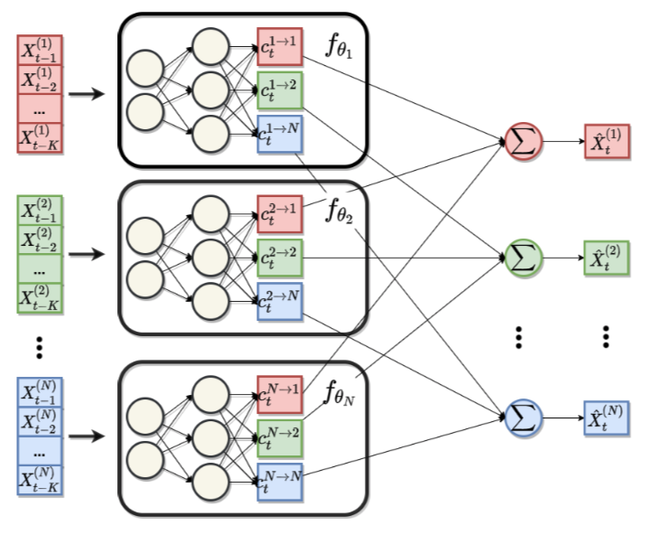

```{r setup, include=FALSE}
knitr::opts_chunk$set(echo = TRUE)
```

# Literature review

## @bussmann2020neural

### Motivation

- In many time series applications the functional dependence of some variable $X_t^{(i)}$ on past lags of some other variable $X_t^{(j)}$ can be expected to be non-linear.
- At the same time, dependencies with respect to multiple covariates can usually be modelled well through additive models (e.g. VAR). 

### Methodology

- Propose a Neural Additive Vector Autoregression (NAVAR) model for causal discovery in time series data
- Let the equation below denote the standard linear VAR where each variable in the system depends linearly on its own lags and those of its covariates:

```{=tex}
\begin{equation}
\begin{aligned}
&& {\mathbf{X}_t}^{(j)}&=\beta^j+ \sum_{i=1}^{N} \sum_{k=1}^{K} [A_k]_{ij} {\mathbf{X}_{t-k}}^{(i)} + \eta_t^j\\
\end{aligned}
(\#eq:var)
\end{equation}
```

```{definition, name="Granger causality"}
Variable $X^{(i)}$ is said to Granger cause another variable $X^{(j)}$ if the past of the set of all (input) variables $\{X_{<t}^{(1)},...,X_{<t}^{(i)},...,X_{<t}^{(N)}\}$ yields better predictions of $X^{(j)}$ then if $X_{<t}^{(i)}$ was excluded.
```

- The NAVAR model instead allows for non-linear interactions between covariates where $f_{ij}$ is the $i$-th output from a deep neural network that maps from all of $j$-th past lags (up to $K$) to all covariates:

```{=tex}
\begin{equation}
\begin{aligned}
&& {\mathbf{X}_t}^{(j)}&=\beta^j+ \sum_{i=1}^{N} f_{ij} \left( {\mathbf{X}_{t-K:t-1}}^{(i)} \right) + \eta_t^j\\
\end{aligned}
(\#eq:navar)
\end{equation}
```

- Notice that if $f$ is linear we are just back to the simple VAR case.

{width="500"}

