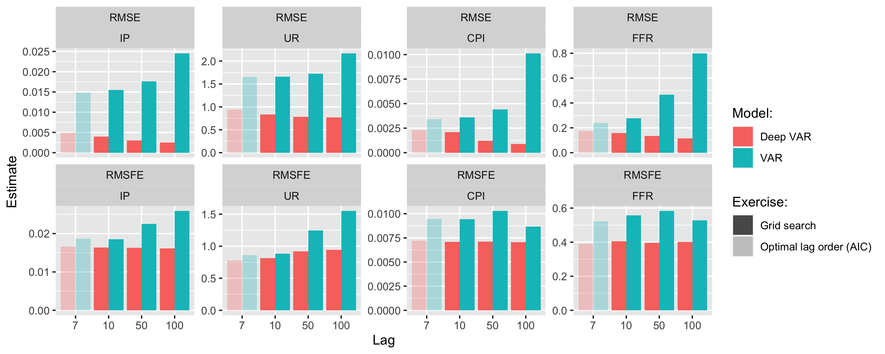

```{r setup, include=FALSE}
library(kableExtra)
library(data.table)
knitr::opts_chunk$set(echo = FALSE, fig.align = "center")
```

## Disclaimer

This presentation was originally used to defend our thesis in June, 2021. As of `r format(Sys.Date(), '%d %B, %Y')` we have only added minor updates. The views expressed in this paper and any remaining errors are own and not those of Delft University of Technology or the European Central Bank.

## At a glance

We effectively extend the conventional linear VAR model to the broader class of Deep VAR. By fitting each equation of the VAR system with a deep neural network the Deep VAR is able to capture non-linear dependencies across time and variables. We find that this leads to significant performance improvements in terms of in-sample fit, out-of-sample fit and point forecasting accuracy.

## Motivation

- Bulk of research on the forecasting of time series to assess the effect of current policy decisions on future economic variables. Accurately modelling and understanding the transmission mechanism is of utmost importance to central bankers.
- The conventional VAR is still one of the most common tools used by practitioners: 
    - Advantages include its simplicity, closed-form solutions for standard errors and straight-forward interpretability.
    - **Shortfall**: imposes linearity.
- While alternatives and extensions of the VAR exist (Bayesian VAR, non-linear VAR, large econometric models, ...) little work has so far been done on integrating deep learning.
- Deep learning has been shown to be remarkably useful for modelling highly non-linear functions of essentially arbitrary form [@goodfellow2016deep].

## Previous literature

- Non-linear dependencies are likely to form part of the data generating process of variables commonly used to model the monetary transmission mechanism [@brock1991nonlinear].
- A range of machine learning models has previously been used in the context of time series forecasting [@hamzaccebi2008improving, @zhang2003time, @kihoro2004seasonal]. Deep learning has been shown to be particularly successful at capturing non-linearities [@zhang1998forecasting, @zhang2003time].
- @joseph2021forecasting review both machine learning and deep learning methods for forecasting inflation and find that neural networks in particular are useful for forecasting especially at a longer horizon.

## Data 

```{r}
dt <- readRDS("../data/data_VAR/preprocessed.rds")
```

- We use the relatively novel FRED-MD data base which is updated monthly and publicly available [@mccracken2016fred]. 
- The sample spans from `r dt[,format(min(date), "%B, %Y")]` to `r dt[,format(max(date), "%B, %Y")]` providing us with a relatively rich data set of macroeconomic time series with $T=`r dt[,.N]`$ observations.

```{r time-series, fig.cap="Time series", out.width=300}
knitr::include_graphics("../www/time_series.png")
```

# Deep VAR methodology

## Form conventional VAR ...

- Recall the conventional VAR($p$) with $p$ lags and a constant deterministic term:

\begin{equation} 
\begin{aligned}
&& \mathbf{y}_t&=\mathbf{c} + \mathbf{A}_1 \mathbf{y}_{t-1} + \mathbf{A}_2 \mathbf{y}_{t-2} + ... + \mathbf{A}_p \mathbf{y}_{t-p} + \mathbf{u}_t \\
\end{aligned}
\end{equation}

- Can be estimated through ordinary least-squared and considered as a **seemingly unrelated regression** (SUR) model composed of individual regressions with common regressors [@greene2012econometric]:

\begin{equation} 
\begin{aligned}
&& y_{it}&=c_i+\sum_{m=1}^{p}\sum_{j=1}^{K}a_{jm}y_{jt-m}+u_{it}&&,&&\forall i=1,...,K\\
\end{aligned}
\end{equation}

## ... to Deep VAR

- Relax the assumption of linearity and instead model the process as system of potentially highly non-linear equations:

\begin{equation} 
\begin{aligned}
&& y_{it}&=f_i\left(\mathbf{y}_{t-1:t-p};\theta\right)+v_{it} &&,&&\forall i=1,...,K \\
\end{aligned}
\end{equation}

- Each single variable is model is modelled as a recurrent neural network:

```{r nn-arch, eval=TRUE, fig.cap="Neural Network Architecture.", echo=FALSE, out.width=125}
knitr::include_graphics("../www/nn2.png")
```

## Long Short-Term Memory

- The most common choice of neural networks architectures for modelling persistent time series is the LSTM:

> "The LSTM [has] the ability to remove or add information to the cell state, carefully regulated by structures called gates. Gates are a way to optionally let information through."
--- @olah2015understanding

\begin{equation} 
\begin{aligned}
&& \mathbf{f}_t&=\sigma \left( \mathbf{b}_f + \mathbf{W}_f\mathbf{h}_{t-1} + \mathbf{U}_f\mathbf{h}_{-1} \right) \\
&& \mathbf{i}_t&=\sigma \left( \mathbf{b}_i + \mathbf{W}_i\mathbf{h}_{t-1} + \mathbf{U}_i\bf{h}_{-1} \right) \\
&& \mathbf{o}_t&=\sigma \left( \mathbf{b}_o + \mathbf{W}_o\mathbf{h}_{t-1} + \mathbf{U}_o\mathbf{h}_{-1} \right) \\
&& \mathbf{C}_t&=\mathbf{f}_t \odot \mathbf{C}_{t-1} + \mathbf{i}_t \odot \tanh \left( \mathbf{b}_C + \mathbf{W}_C\mathbf{h}_{t-1} + \mathbf{U}_C\mathbf{h}_{-1} \right) \\
&&\mathbf{h}_{t}&=\mathbf{o}_t \odot \tanh (\mathbf{C}_t) \\
&& \hat{y}_{it}&=c + \mathbf{v}^T\mathbf{h}_t\\
\end{aligned}
\end{equation}

## Model selection

- With respect to the lag order $p$ we initially use the Akaike Information Criterion for both the VAR and Deep VAR.
- We check for stability of the process by looking at the $Kp$ eigenvalues of the companion matrix of the VAR.
- For the neural networks underlying the baseline Deep VAR we use a depth of two layers and a constant width of 100 neurons. 
- The neural networks are regularized through dropout.

# Findings

## In-sample loss

```{r cum-loss-full, eval=TRUE, fig.cap="Comparison of cumulative loss over the entire sample period for Deep VAR and benchmarks.", out.width=300}
knitr::include_graphics("../www/cum_loss_full.png")
```

## Out-of-sample loss

```{r rmse, eval=TRUE}
tab_rmse <- readRDS("../results/train_test_tab_rmse.rds")
knitr::kable(
  tab_rmse, 
  col.names = c("Sample", "Variable", "DVAR", "VAR", "Ratio (DVAR / VAR)"),
  digits = 5,
  caption = 'Root mean squared error (RMSE) for the two models across subsamples and variables.'
) 
```

## Out-of-sample forecasting errors

```{r fcst, eval=TRUE}
tab_fcst <- readRDS("../results/tab_fcst.rds")
knitr::kable(
  tab_fcst, digits=5,
  caption = "Comparison of n-step ahead pseudo out-of-sample forecasts."
) %>% 
  kable_styling(
    font_size = 6
  )
```

## Varying hyperparameters

```{r grid-benchmark, eval=TRUE, fig.cap="Pseudo out-of-sample RMSE and RMSFE for both models across the different lag choices. For the sake of completeness we also include the performance measures we obtained when we initially ran both models using the optimal lag order as determined by the AIC.", out.width=330}

```

# Discussion

## Caveats and extensions

- Policy-makers rarely base their decisions solely on point estimates, so ultimately our proposed Deep VAR framework needs to be able to quantify uncertainty around estimates.
    - **Monte Carlo dropout**: distribution over point estimates through the introduction of stochasticity
- Support for the estimation of impulse response functions and variance decompositions is another missing cornerstone in the current version of our proposed framework.
    - @verstyuk2020modeling manages to recover IRFs numerically; should be readily applicable to our Deep VAR framework.
- To allow for a 'fairer' comparison we need to let non-linear VAR (**recently added**) and large econometric models enter into the horse race.

## Concluding remarks

- To the best of our knowledge we are the first to propose a framework for Deep VAR that relies on the premise of minimal intervention in the conventional and trusted framework.
- We show that relaxing the linearity constraint leads to a massive boost in model performance.
- To allow for reproducibility we provide a companion [R package](https://github.com/pat-alt/deepvars).
- We have continued discussion with a handful of very kind and helpful advisers from academia and central banks including: 
    - **Eddie Gerba** - Research Manager at the Bank of England
    - **Chiara Osba** - Adviser in the Directorate General Economics of the European Central Bank
    - **Cynthia Liem** - Associate Professor of Artificial Intelligence at Delft University of Technology

# Your questions and comments

## References {.allowframebreaks}

<div id="refs"></div>

# Hiddens

## LSTM - Forget gate


## LSTM - Input gate


## LSTM - Output gate


