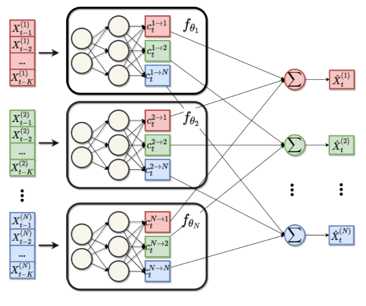

Neural additive Vector Autoregression for Macroeconomic Data
================
Marc Agustí (<marc.agusti@barcelonagse.eu>)Patrick Altmeyer
(<patrick.altmeyer@barcelonagse.eu>)Ignacio Vidal-Quadras Costa
(<ignacio.vidalquadrascosta@barcelonagse.eu>)
April, 2021

Economists and policy makers recognise the undeniable potential of
emerging AI technologies and Data Science, but they are rightly hesitant
to adopt novel models and tools that they cannot trust. The ability to
explain one’s actions and decisions is especially crucial for
institutions such as central banks whose policies affect the livelihoods
of millions of people. It is therefore not surprising that the body of
machine learning literature concerned with interpretability has recently
gained considerable momentum.

Some advancements have emerged from that literature, among those
post-hoc methods which aim to extract feature importance. Shapley values
which come from cooperative game theory are often used, but come with a
prohibitive computational burden. A more novel approach recently
proposed by [Ish-Horowicz et al.](#ref-ish2019interpreting)
([2019](#ref-ish2019interpreting)) provides an intuitive entropy measure
for variable importance, but is only applicable in the Bayesian setting
(see here for a summary).

Another recent paper take more of an ad-hoc approach to
interpretability, that is it aims at retaining some of the simplicity
and structure of a traditional vector autoregressive model (VAR):
[Bussmann, Nys, and Latré](#ref-bussmann2020neural)
([2020](#ref-bussmann2020neural)) propose a Neural Additive Vector
Autoregression (NAVAR) model for causal discovery in time series data.
Let the equation below denote the standard linear VAR

where each variable in the system depends linearly on its own lags and
those of its covariates. Then the NAVAR model is then denoted as

instead allows for non-linear interactions between covariates where
*f**i**j* is the *i*-th output from a deep neural network
that maps from all of *j*-th past lags (up to *K*) to all covariates.
Notice that if *f* is linear we are just back to the simple VAR case.

<figure>
<figcaption aria-hidden="true">Graphical illustration of NAVAR model with MLPs. Source: <a href="#ref-bussmann2020neural" role="doc-biblioref">Bussmann, Nys, and Latré</a> (<a href="#ref-bussmann2020neural" role="doc-biblioref">2020</a>)</figcaption>
</figure>

The model is applied in a time series setting where the time
dimensionality *T* is much larger than the cross-section *D*. This is
typically the case in many macroeconomic time series applications. In
our paper we aim to compare outputs from a standard VAR model for the
monetary transmission mechanism, to outputs from a NAVAR model. In light
of the discussion above, our focus would primarily be on model
interpretability, with forecasting performance taking only a secondary
role (we keenly want to avoid a “horse race” type of analysis). In terms
of data, we can rely on publicly available time series data on
macroeconomic indicators at quarterly or monthly frequency, for example,
using the FRED-QD or
[FRED-MD](https://www.stlouisfed.org/on-the-economy/2016/december/big-data-fred-md)
database.

Notice that the neural networks run for each variable at each step *t*
still suffer from the inherent Black Box problem. Should we find that an
understanding of the step-wise interactions between all covariates also
need to be well understood, we may try to use either Shapley values or
the novel measure mentioned above.

# References

Bussmann, Bart, Jannes Nys, and Steven Latré. 2020. “Neural Additive
Vector Autoregression Models for Causal Discovery in Time Series Data.”
*arXiv Preprint arXiv:2010.09429*.

Ish-Horowicz, Jonathan, Dana Udwin, Seth Flaxman, Sarah Filippi, and
Lorin Crawford. 2019. “Interpreting Deep Neural Networks Through
Variable Importance.” *arXiv Preprint arXiv:1901.09839*.

